Now let's start on to the CloudFormation setup and continue step by step.

**1.** Firstly, let's subscribe to the Ant Media Server on the Amazon Marketplace. Open the link: https://aws.amazon.com/marketplace/pp/B07569Y9SJ/ then please proceed by clicking “Continue to Subscribe” button.

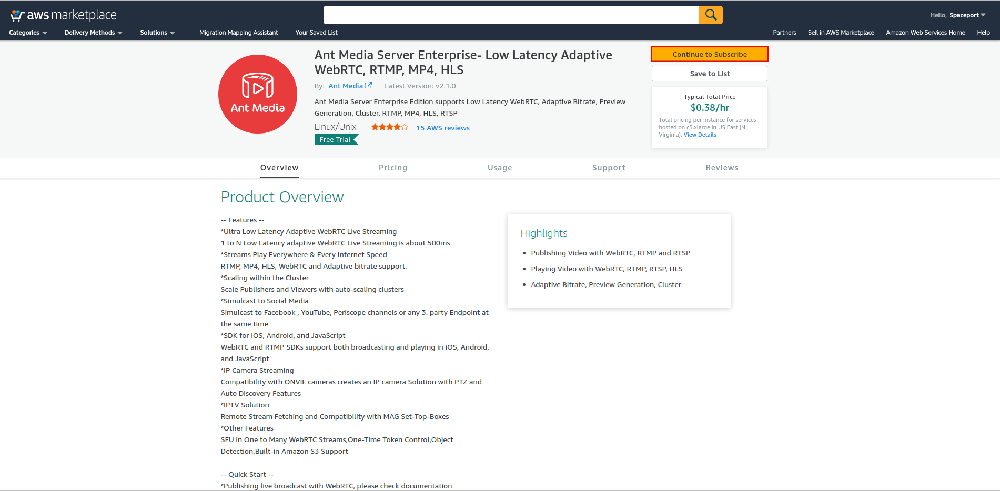

**2.** Please proceed by clicking “Accept Terms” button

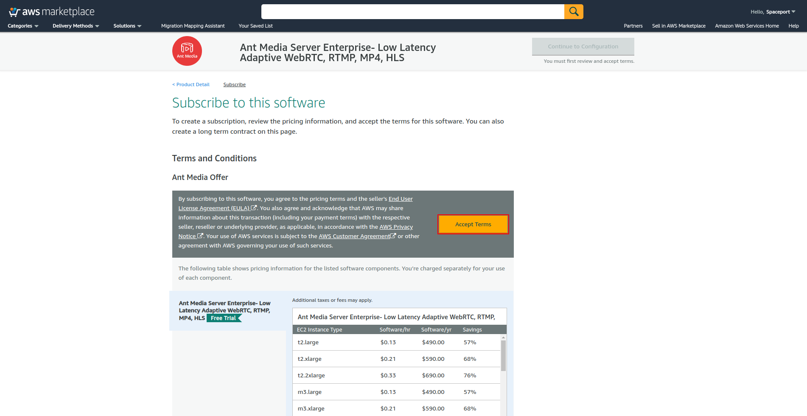

**3.** if everything goes well, you will see the screenshot below.

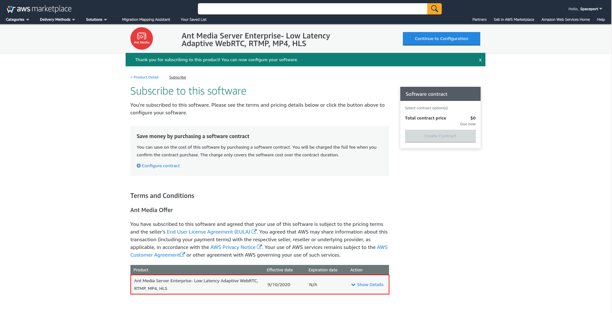

**4.** Now, download the CloudFormation template from the below link to your computer.

[https://raw.githubusercontent.com/ant-media/Scripts/master/antmedia-aws-autoscale-template.yml](https://raw.githubusercontent.com/ant-media/Scripts/master/antmedia-aws-autoscale-template.yml)

**5.** Log in to the AWS Dashboard and find CloudFormation in the search box.

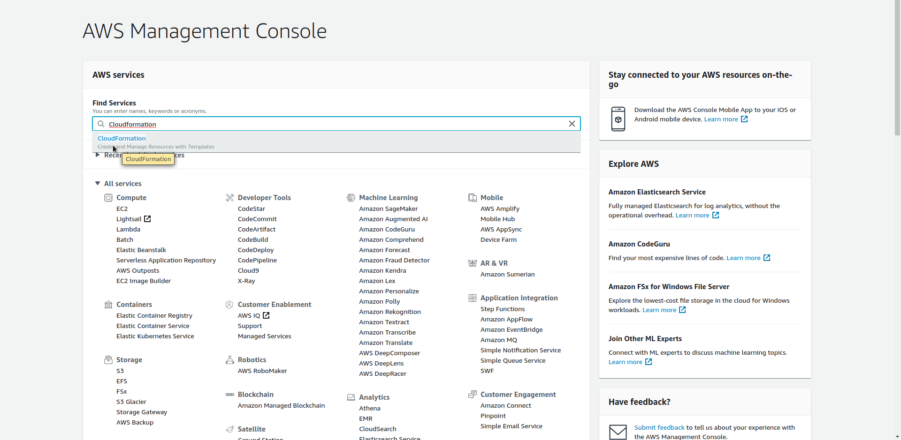

**6.** Click on "Create Stack" from the menu.

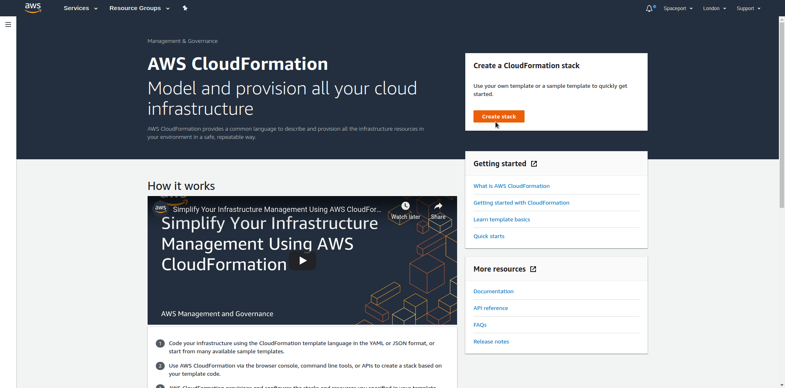

**7.** Select "Upload a Template File" and upload the downloaded file.

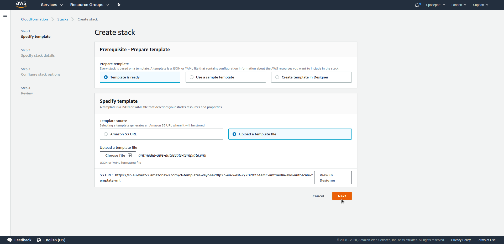

**8.** The menu that below is where we will adjust all our settings.

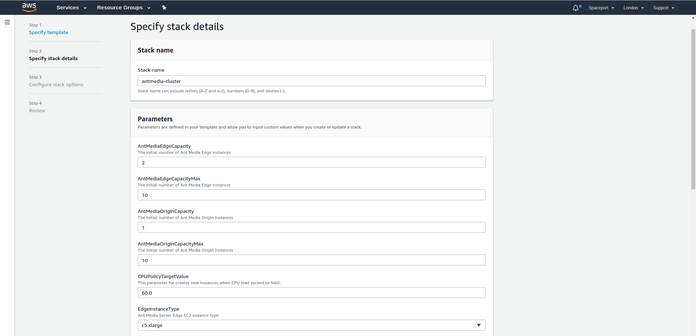

- **Stack Name:** it will describe your stacks, it will be like a skeleton
- **AntMediaEdgeCapacity:** How many Edge servers will be created.
- **AntMediaEdgeCapacityMax:** Edge Server where Auto Scale will reach maximum
- **AntMediaOriginCapacity:** How many Origin servers will be created.
- **AntMediaOriginCapacityMax:** Origin Server where Auto Scale will reach maximum
- **CPUPolicyTargetValue:** Average CPU utilization of the Auto Scaling group. When the server reaches %60 CPU utilization average, new servers will be added
- **EdgeInstanceType:** Edge Instance Type

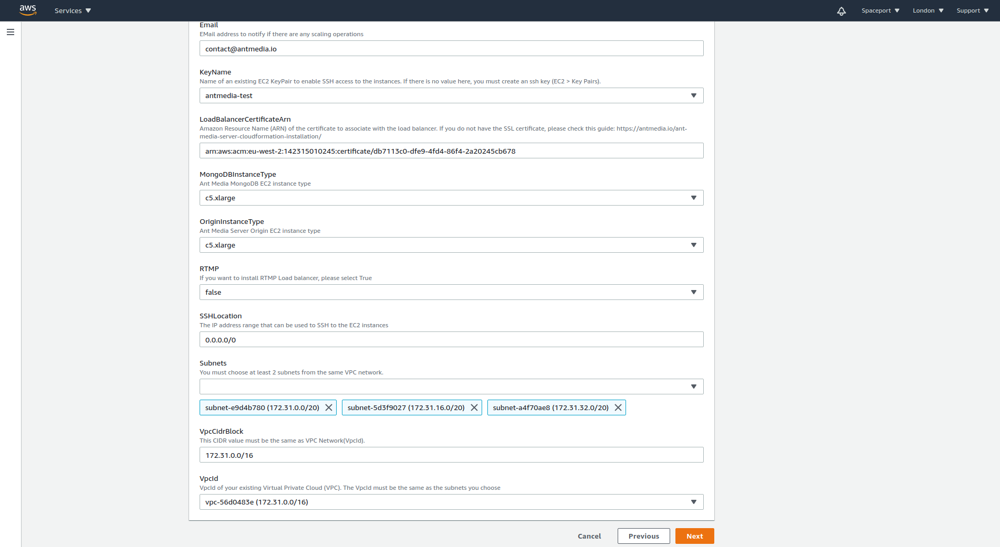

- **Email:** Subscription Email
- **KeyName:** An Amazon EC2 key pair name.If there is no value here, you must create an ssh key (EC2 > Key Pairs).
- **LoadBalancerCertificateArn:** Amazon Resource Name (ARN) of the certificate to associate with the load balancer. Please check this guide: https://antmedia.io/ssl-from-aws-certificate-manager-for-domain-name/
- **MongoDBInstanceType:** MongoDB Instance Type
- **OriginInstanceType:** Origin Server Instance Type
- **RTMP:** If you want to install RTMP Load balancer, please select True
- **SSHLocation:** The IP address range that can be used to SSH to the EC2 instances
- **Subnets:** The list of SubnetIDs in your Virtual Private Cloud (VPC). You must choose at least 2 subnets from the same VPC network.
- **VpcCidrBlock:** Associates a CIDR block with your VPC. It should be the same as the VPC Network.
- **VpcId:** VpcId of your existing Virtual Private Cloud (VPC). The VpcId must be the same as the subnets you choose.

**9.** Please proceed by clicking “Next” button

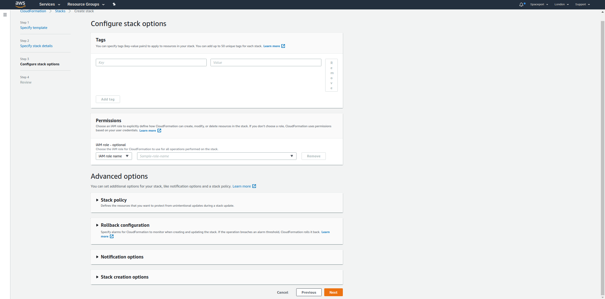

**10.** In this section, you can view and check the summary of the parameters you have entered and you can edit it here as below.

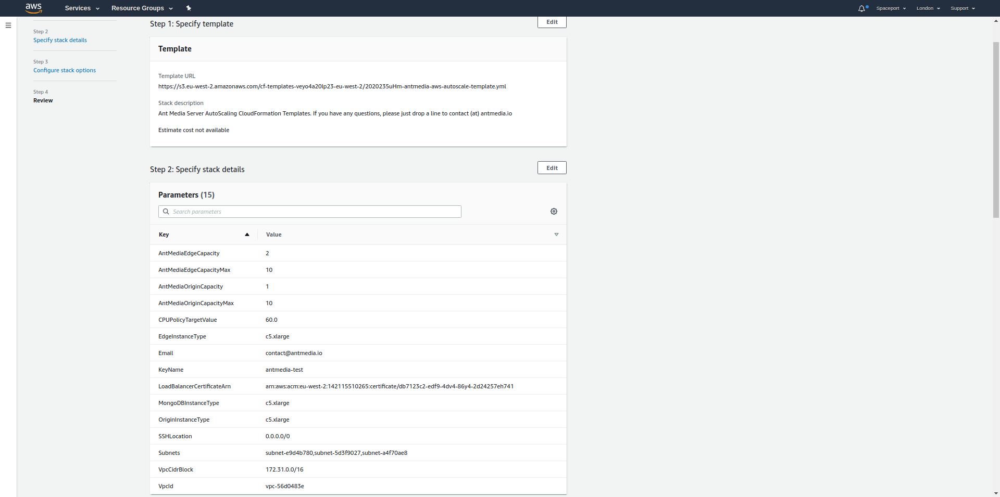

We are using AWS Lambda, so IAM permissions are needed to get our latest image.

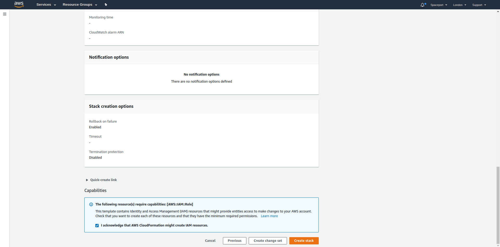

**11.** If the template has been installed successfully, it says "Create Complete" in the red rectangle.

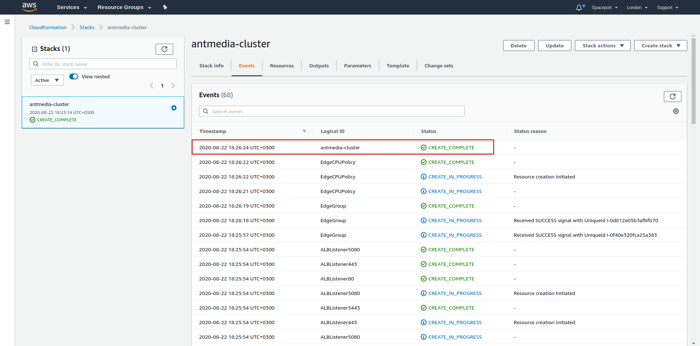

**12.** You can access the URL addresses for LoadBalancer HTTP and HTTPS in the Outputs tab. If you define the CNAME record for the domain you have defined on Certificate Manager to the Load Balancer address below, you can access Ant Media Server without a certificate error on the domain you have defined.

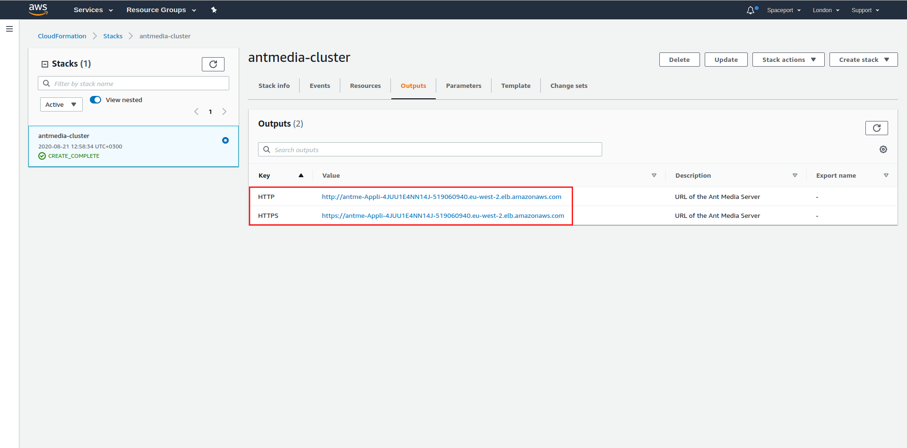

**13.** You can login to web panel via the https://your-domain-name/ and login with “JamesBond” and the first instances  instance-id in your origin group. If you don’t know the instance-id, please ssh to your mongodb instance and write the below commands via terminal

```
$ mongo
> use serverdb
> db.User.find()
```

It gives you an output like this

`{ "_id" : ObjectId("5d31612a4c79142df7c71914"), "className" : "io.antmedia.rest.model.User", "email" : "JamesBond", "password" : "i-1234567890abcdef0", "userType" : "ADMIN" }`

Your password is the one in “password” field in the format “i-xxxxxxxx”

**13.** When you type the URL of the Loadbalancer, Ant Media Dashboard will be opened as below

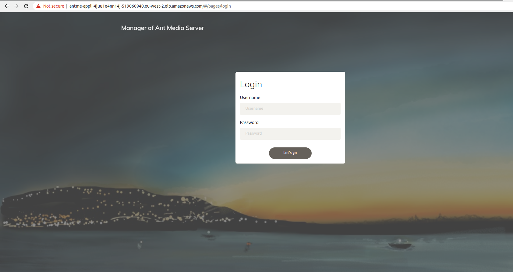

When you click on the Cluster tab, you can see the servers in Cluster.

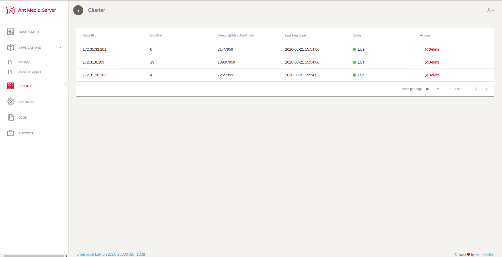

**14.** When you delete a stack, the AWS CloudFormation deletes all resources in that stack.

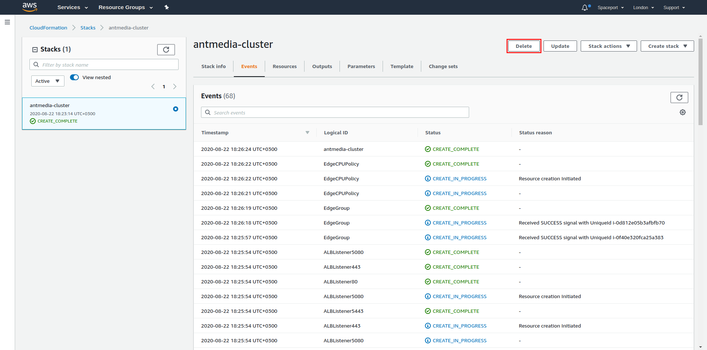

I have covered most of the topics around Cloud Formation. Coming to the question of what we have gained by using CloudFormation and Ant Media Server template, the following steps will take place while sipping your coffee.

- EC2 instance
- Security group
- Ant Media Server Installation
- Ant Media Server Cluster Configuration
- AutoScale
- Load Balancer

If you have any questions, please just drop a line to contact (at) antmedia.io
