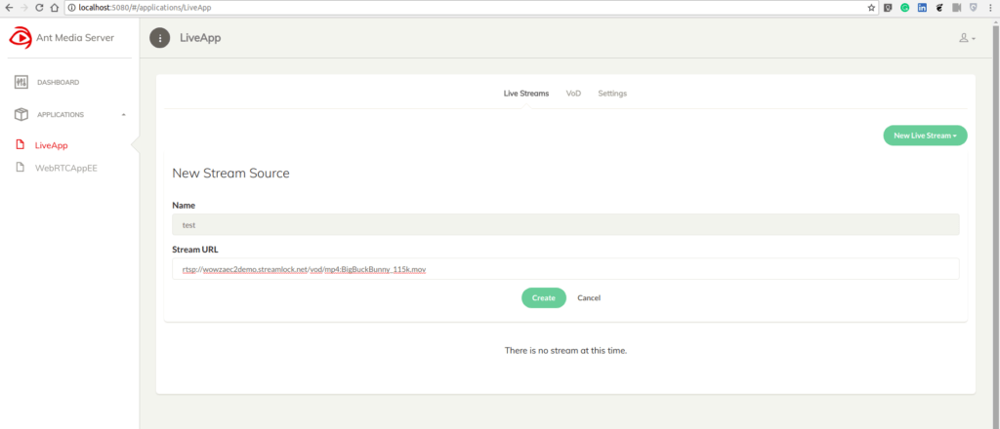
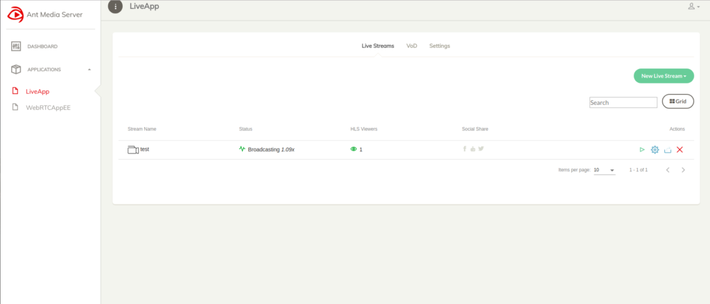
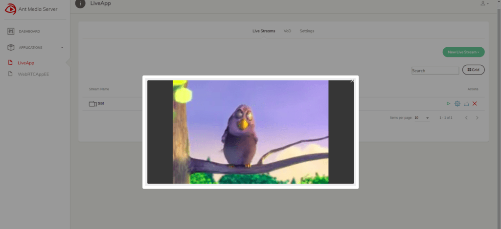

# External Streams Sources(RTMP/HLS/RTSP)

Ant Media Server has the ability to pull live streams from external sources. Such as; live TV streams, IP camera streams or other forms of live streams(RTSP, HLS, TS, FLV, etc.). We will first show how to pull live streams with Web Interface.

Re-streaming from External Source is available both in Community and Enterprise Edition. 

## Pull Live Streams with Web Interface

* First, log in to the management panel. Click any app on the left side menu and then click `New Live Stream -> Stream Source`. Define the stream name and stream source URL.

* Click `Create` button and Ant Media Server starts to pull streams from its source.

* Now, you can watch the stream like any other stream. 

> Reminder: All web interface operations and much more can be done programmatically with [REST API](https://antmedia.io/rest). Take a look at the [REST Guide](REST-Guide)  