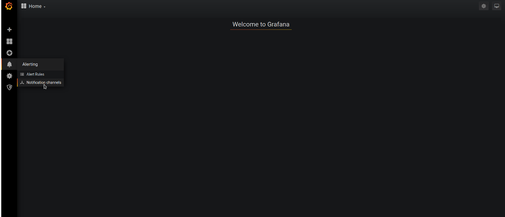

In this document, you can monitor Ant Media Server with Kafka, Elastic Search, and Grafana.

## **Installation Steps**

* [Kafka Installation and Configuration](#Install-Kafka)

* [Elasticsearch Installation](#Install-Elastic-Search)

* [Logstash Installation and Configuration](#Install-Logstash)

* [Grafana Installation and Configuration](#Install-Grafana)

### 1. Install Kafka

Kafka is useful for building real-time streaming data pipelines to get data between the systems or applications.

Apache Kafka requires Java. You must have installed java on your system

`apt-get update && apt-get install openjdk-8-jdk -y`

Download the Apache Kafka binary files from its official download website and then extract the archive file

`wget -qO- https://archive.apache.org/dist/kafka/2.2.0/kafka_2.12-2.2.0.tgz | tar -zxvf- -C /opt/ && mv /opt/kafka* /opt/kafka`

* Edit **server.properties** file as below.

`vim /opt/kafka/config/server.properties`

`listeners=PLAINTEXT://your_server_ip:9092`

* Start Kafka

Kafka required ZooKeeper so first, start a ZooKeeper server on your system then start Kafka
```
/opt/kafka/bin/zookeeper-server-start.sh /opt/kafka/config/zookeeper.properties &
/opt/kafka/bin/kafka-server-start.sh /opt/kafka/config/server.properties &
```
If you see that the port 9092 and 2181 are in listening mode in the following output, everything is normal.

`netstat -tpln | egrep "9092|2181"`

* Run Kafka as systemd service

This will help to manage Kafka services to start/stop using the systemctl command.

to create systemd unit file for Kafka with below command:

Add the below content. Make sure to set the correct JAVA_HOME path as per the Java installed on your system.

### Kafka systemd file


`vim /lib/systemd/system/kafka.service`
```
[Unit]
Description=Apache Kafka Server
Requires=network.target remote-fs.target
After=network.target remote-fs.target kafka-zookeeper.service

[Service]
Type=simple
Environment=JAVA_HOME=/usr/lib/jvm/java-1.8.0-openjdk-amd64
ExecStart=/opt/kafka/bin/kafka-server-start.sh /opt/kafka/config/server.properties
ExecStop=/opt/kafka/bin/kafka-server-stop.sh

[Install]
WantedBy=multi-user.target
```
### Kafka-Zookeeper systemd file

Create systemd unit file for Zookeeper with below command

`vim /lib/systemd/system/kafka-zookeeper.service` 
```
[Unit]
Description=Apache Zookeeper Server
Requires=network.target remote-fs.target
After=network.target remote-fs.target

[Service]
Type=simple
Environment=JAVA_HOME=/usr/lib/jvm/java-1.8.0-openjdk-amd64
ExecStart=/opt/kafka/bin/zookeeper-server-start.sh /opt/kafka/config/zookeeper.properties
ExecStop=/opt/kafka/bin/zookeeper-server-stop.sh

[Install]
WantedBy=multi-user.target
```
Enable and reload the systemd daemon to apply new changes.
```
systemctl enable kafka-zookeeper.service
systemctl enable kafka.service
```
Start kafka server
```
systemctl start kafka-zookeeper.service
systemctl start kafka.service
```
#### Some Kafka commands

* List all topics

`/opt/kafka/bin/kafka-topics.sh --list --bootstrap-server your_kafka_server:9092`

Example:
```
/opt/kafka# bin/kafka-topics.sh --list --bootstrap-server 192.168.1.230:9092
ams-instance-stats
ams-webrtc-stats
kafka-webrtc-tester-stats
```
* Using Kafka Consumer

`/opt/kafka/bin/kafka-console-consumer.sh --bootstrap-server 192.168.1.230:9092 --topic ams-instance-stats --from-beginning`

#### Ant Media Server Kafka settings

If you want to monitor AMS, you need to define specify IP address and Kafka port in AMS_INSTALLTION_DIR/conf/red5.properties file.

Open the following line with the editor

`vim /usr/local/antmedia/conf/red5.properties` 

Edit the following line

`server.kafka_brokers=ip_address:port_number`

Example:
`server.kafka_brokers=192.168.1.230:9092`

Finally, restart Ant Media Server.

`service antmedia restart`

When you run the following command on Kafka server, if there is data flow, everything is configured properly.

`/opt/kafka/bin/kafka-console-consumer.sh --bootstrap-server 192.168.1.230:9092 --topic ams-instance-stats --from-beginning`

Output:
```
{"instanceId":"a06e5437-40ee-49c1-8e38-273544964335","cpuUsage":{"processCPUTime":596700000,"systemCPULoad":0,"processCPULoad":1},"jvmMemoryUsage":{"maxMemory":260046848,"totalMemory":142606336,"freeMemory":21698648,"inUseMemory":120907688},"systemInfo":{"osName":"Linux","osArch":"amd64","javaVersion":"1.8","processorCount":1},"systemMemoryInfo":{"virtualMemory":2288324608,"totalMemory":1033015296,"freeMemory":95338496,"inUseMemory":937676800,"totalSwapSpace":2065690624,"freeSwapSpace":2065416192,"inUseSwapSpace":274432},"fileSystemInfo":{"usableSpace":3274645504,"totalSpace":10498625536,"freeSpace":3828133888,"inUseSpace":6670491648},"jvmNativeMemoryUsage":{"inUseMemory":321179648,"maxMemory":520093696},"gpuUsageInfo":[],"localWebRTCLiveStreams":0,"localWebRTCViewers":0,"localHLSViewers":0,"encoders-blocked":0,"encoders-not-opened":0,"publish-timeout-errors":0,"server-timing":{"up-time":22446386,"start-time":1583128594707},"time":"2020-03-02T12:10:18.257Z"}
```

### Install Elastic Search

To begin, run the following commands to import the Elasticsearch public GPG key into APT, install prerequisites packages and add the Elastic source list to the sources.list.d directory.
```
wget -qO - https://artifacts.elastic.co/GPG-KEY-elasticsearch | sudo apt-key add -
sudo apt-get install apt-transport-https
echo "deb https://artifacts.elastic.co/packages/7.x/apt stable main" | sudo tee -a /etc/apt/sources.list.d/elastic-7.x.list
```

update your package lists

`apt-get update`

Then install Elasticsearch with the following command

`apt-get install elasticsearch`

Enable and start elasticsearch service
```
systemctl enable elasticsearch.service
systemctl start elasticsearch.service
```
### Install Logstash

Logstash is a server‑side data processing pipeline that ingests data from multiple sources simultaneously, transforms it, and then sends it to a “stash” like Elasticsearch

update your package lists, then install logstash with the following command
```
apt-get update && apt-get install logstash
```
enable logstash service

`systemctl enable logstash.service`


Create **/etc/logstash/conf.d/logstash.conf** file and add below content.

```
#kafka
input {
  kafka {
    bootstrap_servers => "kafka_server_ip:9092"
    client_id => "logstash"
    group_id => "logstash"
    consumer_threads => 3
    topics => ["ams-instance-stats","ams-webrtc-stats","kafka-webrtc-tester-stats"]
    codec => "json"
    tags => ["log", "kafka_source"]
    type => "log"
  }
}

#elasticsearch
output {
  elasticsearch {
       hosts => ["127.0.0.1:9200"] #elasticsearch_ip
       index => "logstash-%{[type]}-%{+YYYY.MM.dd}"
  }
  stdout { codec => rubydebug }
}
```
Save and close the file, then restart logstash service

`systemctl restart logstash`

#### How to test Elasticsearch and Logstash
You can test that Elasticsearch and Logstash are working correctly with the command below.

`curl -XGET 'localhost:9200/_cat/indices?v&pretty'`

Example output:
```
health status index                   uuid                   pri rep docs.count docs.deleted store.size pri.store.size
yellow open   logstash-log-2020.03.23 mf-ffIHBSNO4s7_YoUr_Rw   1   1       1300            0    527.5kb        527.5kb
```
### Install Grafana

Grafana is an open source metric analytics & visualization suite.

In order to install Grafana Server, run the following commands.
```
sudo apt-get install -y software-properties-common wget apt-transport-https
wget -q -O - https://packages.grafana.com/gpg.key | sudo apt-key add -
sudo add-apt-repository "deb https://packages.grafana.com/oss/deb stable main"
sudo apt-get update && sudo apt-get install grafana
```
enable and start grafana server 
```
systemctl enable grafana-server
systemctl start grafana-server
```
login as follow

`http://your_ip_address:3000/login`

Default username and password

`admin/admin`

**1.** Click `Add data source`


**2.** Select Elasticsearch


**3.** Set setting as below
```
URL : http://127.0.0.1:9200
Index name: logstash-
Time filed name: @timestamp
Version: 7.0+
```


**4.** Click `New dashboard`


**5.** Click `Add Query`


**6.** Choose whatever you want to monitor.

`Query: ElasticSearch`


**7.** Ant Media Example Dashboard


#### Grafana Telegram Alert
1. Create a New Bot
* Open Telegram and search for @BotFather user and send commands to them the following.
**/newbot**
enter please your bot name 
**antmedia_grafana**
enter your bot username
**antmedia_grafana_test_bot**

and then you will get as below lines.

Use this token to access the HTTP API:
1254341629:AAHYHhJK8TgsUXa7jqBK7wU1bJ8hzWhUFzs
Keep your token secure and store it safely, it can be used by anyone to control your bot.

2. Create a Channel and retrieve the channel's chat ID. 
* Create a channel in telegram
* Invite your bot to that channel as admin
* Send a test message.
* Get the Chat id

Use cURL or just place this on any Browsers Address Bar:

https://api.telegram.org/bot1254341629:AAHYHhJK8TgsUXa7jqBK7wU1bJ8hzWhUFzs/getUpdates

You will get the below lines.

{"ok":true,"result":[{"update_id":222389875,
"channel_post":{"message_id":2,"chat":{"id":-1001181377238,"title":"test","type":"channel"},"date":1587016720,"text":"test"}}]}

You need that number: -1001181377238 

We have configured the chatbot. Now let's start to configure Grafana Notification.

Login to Grafana

http://your_grafana_server:3000

Click Alerting / Notification Channel



Add New Channel

You can configure as below screenshot

Name : name_of_your_notification.
Type : Telegram
Bot Api Token: your_bot_token_id
Chat ID: your_channel_id

If you click on the Send Test and there is a message on the telegram, everything is fine.

Now you can set up notifications as you wish.
