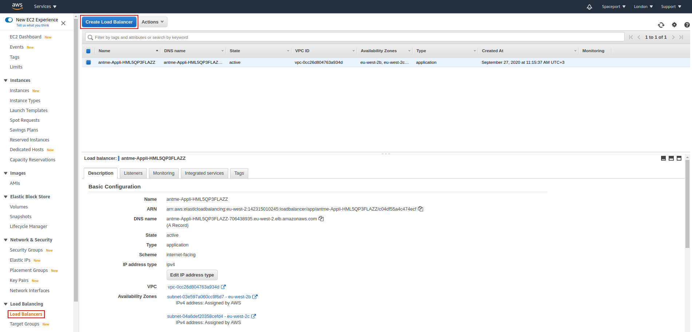
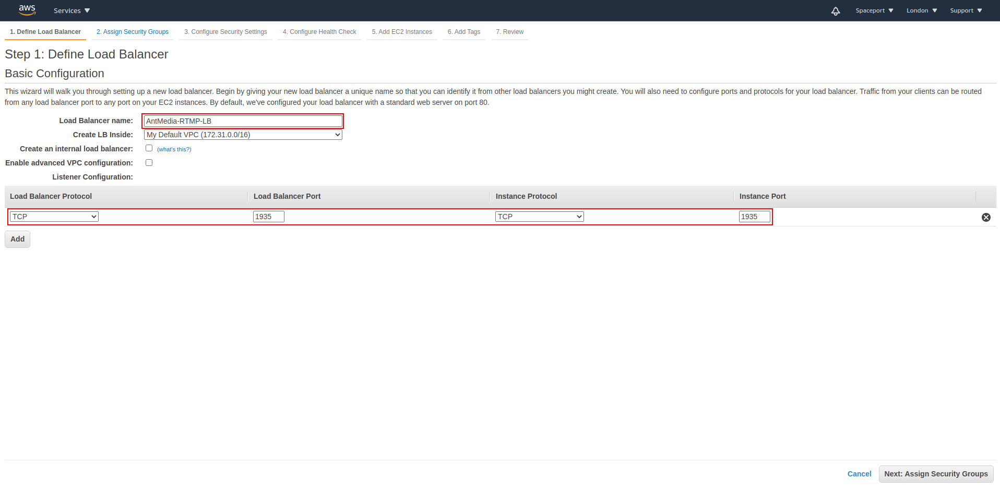
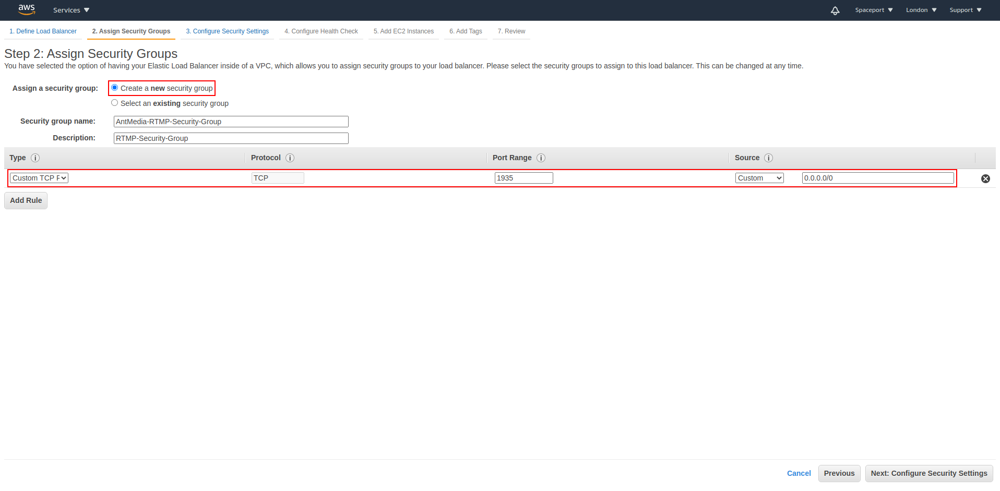

Follow the instructions below to configure RTMP Load Balancer in Ant Media Server Auto Scaling structure.

**1.** Click on Create Load Balancer and create a new Load Balancer. (EC2 > Load Balancers > Create Load Balancer )



**2.** Create a Classic Load Balancer.

**3.** Adjust the settings as in the red rectangles.

**4.** In this section, select Create a New Security Group and adjust the settings as in the Red rectangle.

**5.** Proceed by clicking “Next: Configure Health Check” button.

**6.** Proceed by clicking “Next: Add EC2 Instances” button.

**7.** Press the Next button without doing anything here.

**8.** Click the Review and Create button here.

**9.** Please proceed by clicking "Create"

**10.** Finish the Load Balancer setup.

**11.** Auto Scaling > Go to Auto Scaling > Auto Scaling Groups and select your Origin Group.

**12.** Edit the Load Balancing setting from this section.

**13.** In this window, add the Classic Load Balancer you have added to the Choose A Load Balancer section and click the Update button.

**14.** If everything is fine, you should see the origin instance when you click the Instance tab from Load Balancing> Load Balancers> Antmedia-RTMP-LB.


Since a new load balancer has been installed, your RTMP URL will be the Load Balancer URL.

**Example:**
```
rtmp://Antmedia-RTMP-LB-962025612.eu-west-2.elb.amazonaws.com/WebRTCAppEE/
```
