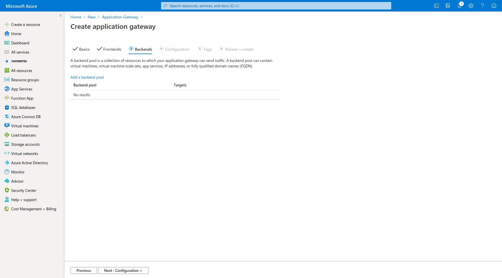

In this guide, I will explain how to setup Ant Media Server Clustering on Azure. When your load is high, one server instance is not enough for you and you can handle that load with a clustering solution.

For streaming applications, you will need a clustering solution when you have high numbers of publishers and viewers. Especially when you require ultra-low latency and adaptive bitrate because they need more processing power. Ultra-low latency is achieved by WebRTC and it is a CPU intensive protocol. Adaptive bitrating is downgrading video quality in bad networks if needed. It is also CPU intensive because there is video conversion. Luckily, Ant Media Server Enterprise Edition supports clustering, so that you can handle the high load in your streaming applications.

Requirements:
To set up media server, Having an Azure account and a ready AntMedia Server Image are needed.

The architecture of the cluster setup could be found here.
Introduction to clustering with AntMedia Server could be found here.

### Step 1: Create a Resource Group

### Step 2: Create a Virtual Network

### Step 3: Create a MongoDB Virtual Machine

### Step 4: Create Application Gateway

