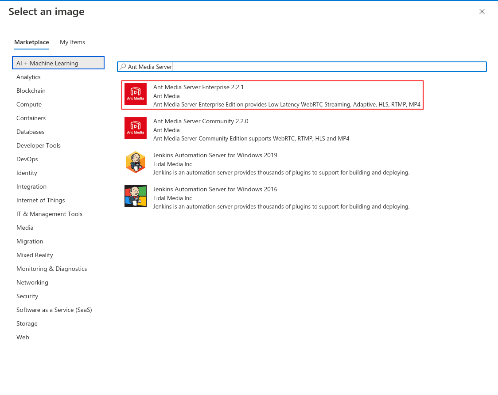

In this guide, I will explain how to setup Ant Media Server Clustering on Azure. When your load is high, one server instance is not enough for you and you can handle that load with a clustering solution.

For streaming applications, you will need a clustering solution when you have high numbers of publishers and viewers. Especially when you require ultra-low latency and adaptive bitrate because they need more processing power. Ultra-low latency is achieved by WebRTC and it is a CPU intensive protocol. Adaptive bitrating is downgrading video quality in bad networks if needed. It is also CPU intensive because there is video conversion. Luckily, Ant Media Server Enterprise Edition supports clustering, so that you can handle the high load in your streaming applications.

Requirements:
To set up media server, Having an Azure account and a ready AntMedia Server Image are needed.

The architecture of the cluster setup could be found here.
Introduction to clustering with AntMedia Server could be found here.

### Step 1: Create a Resource Group

[](https://raw.githubusercontent.com/wiki/ant-media/Ant-Media-Server/images/azure/create-resource-1.png)

[](https://raw.githubusercontent.com/wiki/ant-media/Ant-Media-Server/images/azure/create-resource-2.png)

[](https://raw.githubusercontent.com/wiki/ant-media/Ant-Media-Server/images/azure/create-resource-3.png)

### Step 2: Create a Virtual Network

We need to create a virtual network named antmedia-cluster-virtual-network, and then we will add gateway-subnet, origin-subnet and edge-subnet as described in this doc.

Click Create a Resource in the portal which is on the upper left.
Enter Virtual network in the Search the Marketplace box at the top of the New pane that appears. Click Virtual network when it appears in the search results.

[](https://raw.githubusercontent.com/wiki/ant-media/Ant-Media-Server/images/azure/virtual-network-1.png)

Select Classic in the Select a deployment model box in the Virtual Network pane that appears, then click Create.

[](https://raw.githubusercontent.com/wiki/ant-media/Ant-Media-Server/images/azure/virtual-network-2.png)

Daha once olusturdugumuz resource grubu secip, name alanina antmedia-clustur-virtual-network yazip "Next: IP Address" butonuna tiklayin.

[](https://raw.githubusercontent.com/wiki/ant-media/Ant-Media-Server/images/azure/virtual-network-3.png)

Add subnet butonuna tiklayip antmedia-origin-subnet, antmedia-edge-subnet ve antmedia-gw-subnet lerini asagidaki sekildeki gibi olusturun.

[](https://raw.githubusercontent.com/wiki/ant-media/Ant-Media-Server/images/azure/virtual-network-4.png)

Olusturdugunuz subnet asagidaki gibi gozukecektir. Her sey tamamsa "Review + create" butonuna tiklayip Virtual Networkunuzu olusturun.

[](https://raw.githubusercontent.com/wiki/ant-media/Ant-Media-Server/images/azure/virtual-network-5.png)

Create butonuna tiklanayarak islem tamamlanir.

[](https://raw.githubusercontent.com/wiki/ant-media/Ant-Media-Server/images/azure/virtual-network-6.png)

### Step 3: Create a MongoDB Virtual Machine

Click Virtual Machines on the left bar and then click +Add:

[](https://raw.githubusercontent.com/wiki/ant-media/Ant-Media-Server/images/azure/mongodb-1.png)

Enter the following values and click next:

[](https://raw.githubusercontent.com/wiki/ant-media/Ant-Media-Server/images/azure/mongodb-2.png)

Enter the following values and click next:

[](https://raw.githubusercontent.com/wiki/ant-media/Ant-Media-Server/images/azure/mongodb-3.png)

Virtual Network kismindan olusturdugumuz Virtual Networku secin, Nic network security Group 'dan Advanced 'i secin ve Create New e tiklayin.

[](https://raw.githubusercontent.com/wiki/ant-media/Ant-Media-Server/images/azure/mongodb-4.png)

Acilan pencerede Add an inbound Rule tiklayin ve asagidaki gibi inbound security rule ekleyin.

[](https://raw.githubusercontent.com/wiki/ant-media/Ant-Media-Server/images/azure/mongodb-6.png)

Enter the following values and click next:

[](https://raw.githubusercontent.com/wiki/ant-media/Ant-Media-Server/images/azure/mongodb-7.png)

Custom data alanina asagidaki satirlari ekleyin ve "Review + Create" butonuna tiklayip MongoDB instnacesini olusturun.
```
#!/bin/bash
wget -qO - https://www.mongodb.org/static/pgp/server-4.2.asc | sudo apt-key add -
echo "deb [ arch=amd64 ] https://repo.mongodb.org/apt/ubuntu `lsb_release -cs`/mongodb-org/4.2 multiverse" | sudo tee /etc/apt/sources.list.d/mongodb-org-4.2.list
sudo apt-get update
sudo apt-get install -y mongodb-org
sed -i 's/bindIp:.*/bindIp: 0.0.0.0/g' /etc/mongod.conf
systemctl restart mongod
```
[](https://raw.githubusercontent.com/wiki/ant-media/Ant-Media-Server/images/azure/mongodb-8.png)


[](https://raw.githubusercontent.com/wiki/ant-media/Ant-Media-Server/images/azure/mongodb-9.png)

### Step 4: Create Application Gateway

Click Create a Resource in the portal which is on the upper left. Enter Application Gateway in the Search the Marketplace box at the top of the New pane that appears. Click Application Gateway when it appears in the search results.

[](https://raw.githubusercontent.com/wiki/ant-media/Ant-Media-Server/images/azure/application-gateway-1.png)

Select Classic in the Select a deployment model box in the Application Gateway pane that appears, then click Create.

[](https://raw.githubusercontent.com/wiki/ant-media/Ant-Media-Server/images/azure/application-gateway-2.png)

Resource Group, Application Gateway Name, Region ve Virtual Network ayarlarini asagidaki gibi giriniz ve "Next: Frontends" e tiklayin.

[](https://raw.githubusercontent.com/wiki/ant-media/Ant-Media-Server/images/azure/application-gateway-3.png)

Add New butonuna tiklayip asagidaki gibi girin ve "Next: Backends" 'e tiklayin.

[](https://raw.githubusercontent.com/wiki/ant-media/Ant-Media-Server/images/azure/application-gateway-5.png)

Add a Backend pool 'a tiklayip ekram goruntusundeki gibi hem origin hem de Edge icin poollar olusturun ve "Next: Configuration" 'a tiklayin.

[](https://raw.githubusercontent.com/wiki/ant-media/Ant-Media-Server/images/azure/application-gateway-7.png)

Add a routing rule 'e atiklayin.

[](https://raw.githubusercontent.com/wiki/ant-media/Ant-Media-Server/images/azure/application-gateway-8.png)

Ekran goruntundeki gibi alanlari doldurup "Backend targets" 'i tiklayin.

[](https://raw.githubusercontent.com/wiki/ant-media/Ant-Media-Server/images/azure/application-gateway-9.png)

Backend target "Edge" poolunu secin ve HTTP settings icon Add new 'e tiklayin.

[](https://raw.githubusercontent.com/wiki/ant-media/Ant-Media-Server/images/azure/application-gateway-10.png)

Asagidaki gibi doldurun. Bu ayar hem origin hem de origin icin olacaktir. 

[](https://raw.githubusercontent.com/wiki/ant-media/Ant-Media-Server/images/azure/application-gateway-11.png)

Ayarlariniz asagidaki gibiyse HTTP istekler icin Edge yapilandirilmasi bitmistir.

[](https://raw.githubusercontent.com/wiki/ant-media/Ant-Media-Server/images/azure/application-gateway-12.png)

Tekrar "Add a routing rule" 'e tiklayip Origin icin HTTP ayarlarini yapalim. Asagidaki gibi ayarlari yapip "Backend target" tiklayin.

[](https://raw.githubusercontent.com/wiki/ant-media/Ant-Media-Server/images/azure/application-gateway-13.png)

Backend target olarak Origin poolunu secin ve HTTP settings olarakta onceden olusturdugumuz "BackendHttpSettings" i secin.

[](https://raw.githubusercontent.com/wiki/ant-media/Ant-Media-Server/images/azure/application-gateway-14.png)

Simdi sirada Origin icin HTTPS isteklerini yonlendirmeye geldi. Bunun icin asagidaki gibi ayarlari yapin. cluster.antmedia.io.pfx sertifikasi icin bu linki kullanabilirsiniz.

[](https://raw.githubusercontent.com/wiki/ant-media/Ant-Media-Server/images/azure/application-gateway-15.png)

Backend target olarak Origin ve HTTP Settings olarak "BackendHttpSetting" secin.

[](https://raw.githubusercontent.com/wiki/ant-media/Ant-Media-Server/images/azure/application-gateway-16.png)

Ayni sekilde Edge icin 5443 icin yapilandirmayi asagidaki gibi yapin.

[](https://raw.githubusercontent.com/wiki/ant-media/Ant-Media-Server/images/azure/application-gateway-17.png)

Backend target olarak Edge ve HTTP Settings olarak "BackendHttpSetting" secin.

[](https://raw.githubusercontent.com/wiki/ant-media/Ant-Media-Server/images/azure/application-gateway-18.png)

Tam olarak application-gateway ayarlari asagidaki gibi gozukecektir. Her sey yolundaysa "Next:Tags" tiklayin.

[](https://raw.githubusercontent.com/wiki/ant-media/Ant-Media-Server/images/azure/application-gateway-19.png)

Son olarak "Create" basarak kurulumu tamamlayin.

[](https://raw.githubusercontent.com/wiki/ant-media/Ant-Media-Server/images/azure/application-gateway-20.png)

### Step 4: Create Edge/Origin Scale Sets

[](https://raw.githubusercontent.com/wiki/ant-media/Ant-Media-Server/images/azure/virtual-machine-1.png)

[](https://raw.githubusercontent.com/wiki/ant-media/Ant-Media-Server/images/azure/virtual-machine-2.png)

[](https://raw.githubusercontent.com/wiki/ant-media/Ant-Media-Server/images/azure/virtual-machine-3.png)

[](https://raw.githubusercontent.com/wiki/ant-media/Ant-Media-Server/images/azure/virtual-machine-3_1.png)

[](https://raw.githubusercontent.com/wiki/ant-media/Ant-Media-Server/images/azure/virtual-machine-4.png)

[](https://raw.githubusercontent.com/wiki/ant-media/Ant-Media-Server/images/azure/virtual-machine-5.png)

[](https://raw.githubusercontent.com/wiki/ant-media/Ant-Media-Server/images/azure/virtual-machine-6.png)

[](https://raw.githubusercontent.com/wiki/ant-media/Ant-Media-Server/images/azure/virtual-machine-7.png)

[](https://raw.githubusercontent.com/wiki/ant-media/Ant-Media-Server/images/azure/virtual-machine-8.png)

[](https://raw.githubusercontent.com/wiki/ant-media/Ant-Media-Server/images/azure/virtual-machine-9.png)

[](https://raw.githubusercontent.com/wiki/ant-media/Ant-Media-Server/images/azure/virtual-machine-10.png)
