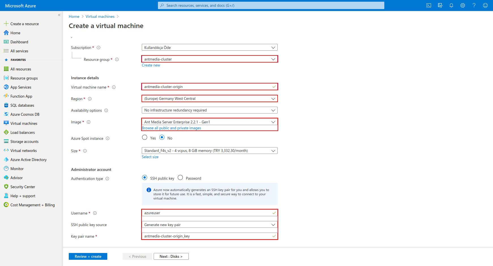

In this guide, I will explain how to setup Ant Media Server Clustering on Azure. When your load is high, one server instance is not enough for you and you can handle that load with a clustering solution.

For streaming applications, you will need a clustering solution when you have high numbers of publishers and viewers. Especially when you require ultra-low latency and adaptive bitrate because they need more processing power. Ultra-low latency is achieved by WebRTC and it is a CPU intensive protocol. Adaptive bitrating is downgrading video quality in bad networks if needed. It is also CPU intensive because there is video conversion. Luckily, Ant Media Server Enterprise Edition supports clustering, so that you can handle the high load in your streaming applications.

**Requirements:**

To set up media server, Having an Azure account and a ready AntMedia Server Image are needed.

The architecture of the cluster setup could be found [here](https://github.com/ant-media/Ant-Media-Server/wiki/Test-Environment#cluster-setup).
Introduction to clustering with AntMedia Server could be found [here](https://github.com/ant-media/Ant-Media-Server/wiki/Clustering).

### Step 1: Create a Resource Group

Each resource created must be in the same resource group. For this, we will first create a resource group. Named **antmedia-cluster**

Click Resource groups in the portal which is on the left side then click **+Add**

[](https://raw.githubusercontent.com/wiki/ant-media/Ant-Media-Server/images/azure/create-resource-1.png)

Enter "**Resource group**" then choose your zone.

[](https://raw.githubusercontent.com/wiki/ant-media/Ant-Media-Server/images/azure/create-resource-2.png)

Proceed by clicking "**Create**" button

[](https://raw.githubusercontent.com/wiki/ant-media/Ant-Media-Server/images/azure/create-resource-3.png)

### Step 2: Create a Virtual Network

We need to create a virtual network named antmedia-cluster-virtual-network, and then we will add gateway-subnet, origin-subnet and edge-subnet

Click Create a Resource in the portal which is on the upper left. Enter Virtual network in the Search the Marketplace box at the top of the New pane that appears. Click Virtual network when it appears in the search results.

[](https://raw.githubusercontent.com/wiki/ant-media/Ant-Media-Server/images/azure/virtual-network-1.png)

click "**Create**"

[](https://raw.githubusercontent.com/wiki/ant-media/Ant-Media-Server/images/azure/virtual-network-2.png)

Select the resource group that we created before, enter **antmedia-cluster-virtual-network** in the name field and click on the "**Next: IP Address**" button.

[](https://raw.githubusercontent.com/wiki/ant-media/Ant-Media-Server/images/azure/virtual-network-3.png)

Click on the Add subnet button and create the antmedia-origin-subnet, antmedia-edge-subnet and antmedia-gw-subnet as shown in the figure below.

[](https://raw.githubusercontent.com/wiki/ant-media/Ant-Media-Server/images/azure/virtual-network-4.png)

The subnets that you created will look like the following. If everything is ok, click the "Review + create" button and create your Virtual Network.

[](https://raw.githubusercontent.com/wiki/ant-media/Ant-Media-Server/images/azure/virtual-network-5.png)

The process is completed by clicking on the "**Create**" button.

[](https://raw.githubusercontent.com/wiki/ant-media/Ant-Media-Server/images/azure/virtual-network-6.png)

### Step 3: Create a MongoDB Virtual Machine

Click Virtual Machines on the left bar and then click "**+Add**"

[](https://raw.githubusercontent.com/wiki/ant-media/Ant-Media-Server/images/azure/mongodb-1.png)

Enter the following values and click "**Next: Disks**"
```
Resource group "antmedia-cluster"
Image "Ubuntu 18.04 LTS"
```
[](https://raw.githubusercontent.com/wiki/ant-media/Ant-Media-Server/images/azure/mongodb-2.png)

Enter the following values and click "**Next: Networking**"

[](https://raw.githubusercontent.com/wiki/ant-media/Ant-Media-Server/images/azure/mongodb-3.png)

Select the Virtual Network that you created, click "**Advanced**" from "**Nic network security group**" and click "**Create new**"

[](https://raw.githubusercontent.com/wiki/ant-media/Ant-Media-Server/images/azure/mongodb-4.png)

Click the "**Add an inbound rule**" button in the windows that appears and click the "**Add inbound security rule**" button

[](https://raw.githubusercontent.com/wiki/ant-media/Ant-Media-Server/images/azure/mongodb-6.png)

Enter the following values and click "**Next: Advanced**"

[](https://raw.githubusercontent.com/wiki/ant-media/Ant-Media-Server/images/azure/mongodb-7.png)

Add the following lines to the "**Custom data**" area and click the "**Review + Create**" button to create a MongoDB instance.

```
#!/bin/bash
wget -qO - https://www.mongodb.org/static/pgp/server-4.2.asc | sudo apt-key add -
echo "deb [ arch=amd64 ] https://repo.mongodb.org/apt/ubuntu `lsb_release -cs`/mongodb-org/4.2 multiverse" | sudo tee /etc/apt/sources.list.d/mongodb-org-4.2.list
sudo apt-get update
sudo apt-get install -y mongodb-org
sed -i 's/bindIp:.*/bindIp: 0.0.0.0/g' /etc/mongod.conf
systemctl restart mongod
```
[](https://raw.githubusercontent.com/wiki/ant-media/Ant-Media-Server/images/azure/mongodb-8.png)

The process is completed by clicking on the "**Create**" button.

[](https://raw.githubusercontent.com/wiki/ant-media/Ant-Media-Server/images/azure/mongodb-9.png)

### Step 4: Create Application Gateway

Click Create a Resource in the portal which is on the upper left. Enter Application Gateway in the Search the Marketplace box at the top of the New pane that appears. Click the "**Application Gateway**" when it appears in the search results.

[](https://raw.githubusercontent.com/wiki/ant-media/Ant-Media-Server/images/azure/application-gateway-1.png)

Proceed by clicking "**Create**" button

[](https://raw.githubusercontent.com/wiki/ant-media/Ant-Media-Server/images/azure/application-gateway-2.png)

Enter the Resource Group, Application Gateway Name, Region, and Virtual Network settings as follows and click "**Next: Frontends**"

[](https://raw.githubusercontent.com/wiki/ant-media/Ant-Media-Server/images/azure/application-gateway-3.png)

Click on the "**Add new**" button and enter the public IP name then click "**Next: Backends**"

[](https://raw.githubusercontent.com/wiki/ant-media/Ant-Media-Server/images/azure/application-gateway-5.png)

Click on "**Add a backend pool**", create pools for both origin and edge as shown in the screenshot, and click "**Next: Configuration**".

[](https://raw.githubusercontent.com/wiki/ant-media/Ant-Media-Server/images/azure/application-gateway-7.png)

Click on "**Add a routing rule**" in the window that appears.

[](https://raw.githubusercontent.com/wiki/ant-media/Ant-Media-Server/images/azure/application-gateway-8.png)

Enter the following values for Edge sides then click "**Add**" button.

[](https://raw.githubusercontent.com/wiki/ant-media/Ant-Media-Server/images/azure/application-gateway-9.png)

Select the "**Edge**" pool as the backend target and click "**Add new**" for HTTP settings.

[](https://raw.githubusercontent.com/wiki/ant-media/Ant-Media-Server/images/azure/application-gateway-10.png)

Enter the following values. These values will be for both origin and edge.

[](https://raw.githubusercontent.com/wiki/ant-media/Ant-Media-Server/images/azure/application-gateway-11.png)

If your settings are as follows, Edge configuration is finished.

[](https://raw.githubusercontent.com/wiki/ant-media/Ant-Media-Server/images/azure/application-gateway-12.png)

Click on "**Add a routing rule**" again and set the HTTP settings for Origin. Make the settings as below and click "**Backend target**".

[](https://raw.githubusercontent.com/wiki/ant-media/Ant-Media-Server/images/azure/application-gateway-13.png)

Select the Origin pool as the backend target and select the "BackendHttpSettings" that we created before as HTTP settings.

[](https://raw.githubusercontent.com/wiki/ant-media/Ant-Media-Server/images/azure/application-gateway-14.png)

Now it's time to forward HTTPS requests to Origin. For this, make the settings as follows. You can use [this link](https://antmedia.io/ssl-for-azure-app-gateway-for-scaling-azure-ant-media/) for a certificate.

[](https://raw.githubusercontent.com/wiki/ant-media/Ant-Media-Server/images/azure/application-gateway-15.png)

Select "**BackendHttpSetting**" as HTTP Settings and  Select "**Origin**" as Backend target.

[](https://raw.githubusercontent.com/wiki/ant-media/Ant-Media-Server/images/azure/application-gateway-16.png)

Likewise, configure port 5443 for Edge as follows.

[](https://raw.githubusercontent.com/wiki/ant-media/Ant-Media-Server/images/azure/application-gateway-17.png)

Select "**BackendHttpSetting**" as HTTP Settings and  Select "**Edge**" as Backend target.

[](https://raw.githubusercontent.com/wiki/ant-media/Ant-Media-Server/images/azure/application-gateway-18.png)

Application-gateway settings will look like the following. If everything is ok, click "**Next: Tags**"

[](https://raw.githubusercontent.com/wiki/ant-media/Ant-Media-Server/images/azure/application-gateway-19.png)

The process is completed by clicking on the "Create" button.

[](https://raw.githubusercontent.com/wiki/ant-media/Ant-Media-Server/images/azure/application-gateway-20.png)

### Step 4: Create Edge/Origin Scale Sets

We need to setup scale sets. Click Create a Resource in the portal which is on the upper left. Enter "**Virtual Machine Scale Set**" in the Search the Marketplace box at the top of the New pane that appears. Click "**Virtual Machine Scale Set**" when it appears in the search results.

[](https://raw.githubusercontent.com/wiki/ant-media/Ant-Media-Server/images/azure/virtual-machine-1.png)

Proceed by clicking "**Create**" button

[](https://raw.githubusercontent.com/wiki/ant-media/Ant-Media-Server/images/azure/virtual-machine-2.png)

First, we will create the Origin Scale Set. Select the Resource Group, enter Virtual Machine scale set name, choose Region settings as follows. Then click on "**Browse all public and private images**"

[](https://raw.githubusercontent.com/wiki/ant-media/Ant-Media-Server/images/azure/virtual-machine-3.png)

In the window that appears, search for Ant Media Server and select the "**Ant Media Server Enterprise 2.1.0**" version.

[](https://raw.githubusercontent.com/wiki/ant-media/Ant-Media-Server/images/azure/virtual-machine-3_1.png)

Enter the following values and click "Next: Networking"

[](https://raw.githubusercontent.com/wiki/ant-media/Ant-Media-Server/images/azure/virtual-machine-4.png)

Select the **antmedia-cluster-virtual-network** that we created before as Virtual Network in this screen. Select the **origin subnet** as Network interface and click “**Yes**” for Use a load balancer choice. Select the application gateway that we created before and select **Origin** as Backend pool then click the "**Next: Scaling**"

[](https://raw.githubusercontent.com/wiki/ant-media/Ant-Media-Server/images/azure/virtual-machine-5.png)

Select Custom and set the Cpu threshold to 60%. You can set other settings according to yourself.

[](https://raw.githubusercontent.com/wiki/ant-media/Ant-Media-Server/images/azure/virtual-machine-6.png)

Continue by clicking directly next to the "**Management**" and "**Health**" tabs and add the following lines to the "**Custom data**" area in the **Advanced section**.

```
#!/bin/bash
cd /usr/local/antmedia/
./change_server_mode.sh cluster 10.0.2.4
```
**10.0.2.4** IP address is the private IP address of the MongoDB instance I have set up before. Change according to your own MongoDB instance.

[](https://raw.githubusercontent.com/wiki/ant-media/Ant-Media-Server/images/azure/virtual-machine-7.png)

Click the "**Create**" button to create the Scale Set for the Origin.

[](https://raw.githubusercontent.com/wiki/ant-media/Ant-Media-Server/images/azure/virtual-machine-8.png)

### Edge

Create a new Scale Set again and repeat the above steps. Then edit the Network interface part as follows. There will be Edge Subnet as the Network Interface and Edge will be selected for the Application Gateway Backend pool.

[](https://raw.githubusercontent.com/wiki/ant-media/Ant-Media-Server/images/azure/virtual-machine-9.png)

Finally, your scale sets will look like the following.

[](https://raw.githubusercontent.com/wiki/ant-media/Ant-Media-Server/images/azure/virtual-machine-10.png)

### Test

If the following pages are responding then your edge / origin redirects are working correctly.

Edge URL Address https://application-gateway-ip:5443

Origin URL Address: https://application-gateway-ip

[](https://raw.githubusercontent.com/wiki/ant-media/Ant-Media-Server/images/azure/antmedia-login.png)

When you go to the Cluster Menu, you can see the joined nodes as below.

[](https://raw.githubusercontent.com/wiki/ant-media/Ant-Media-Server/images/azure/antmedia-cluster.png)