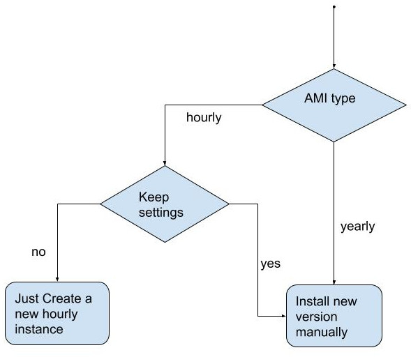

When you get the new version news for Ant Media Server AMI, you may want to use the new version. There are two alternatives: just start a new EC2 instance through AWS Marketplace or install the new version manually on the running server. This post is a guide for you that tells how you can upgrade manually. 

Installation On Running AWS Instance:
Contact Us: send email to contact@antmedia.io and ask for the new version
Connect your server with ssh
Download the new version of Ant Media Server to your instance
Install new version as told in [this document](https://github.com/ant-media/Ant-Media-Server/wiki/Installation)