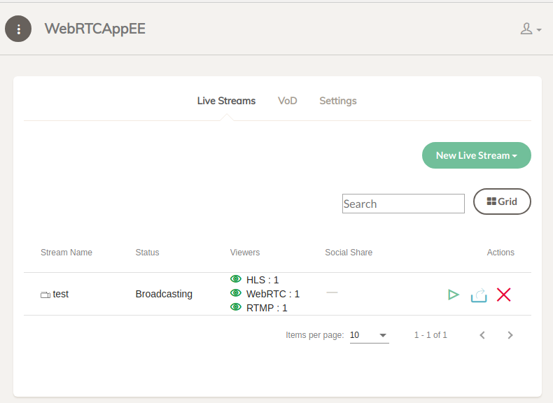
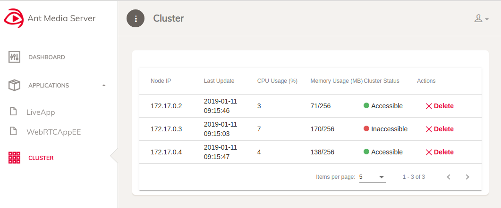

# Dashboard
Todo
# Application Pages
## Live Streams
### Live Streams Table
#### Stream Name
#### Status
#### Viewers
In this column of the Live Stream Table number of subscribers of the stream are presented. This presentation is made separately for each protocol ie. WebRTC, HLS and RTMP as shown in the image below.

#### Social Share
#### Actions
# Cluster Page
Cluster page can be opened from the sidebar of the management console. In cluster page, there is a cluster table in which cluster nodes are listed as rows.

In cluster mode, each node registers itself to MongoDB as a cluster node. All registered nodes are listed in the cluster table even if it is off at the moment.

In the image above there are 3 nodes in MongoDB but the node with IP 172.17.0.3 is not in the cluster at the moment. If you don't want to see it in the cluster table anymore, you can delete it by clicking the Delete icon under the Actions column.

## Columns:
**Node IP:** It shows the IP address of the node.\
**Last Update:** Each node updates its status in MongoDB with a period. This column shows the last update time.\
**CPU Usage:** It shows the CPU usage percentage of the node.\
**Memory Usage:** It shows the heap memory usage/total heap of the node.\
**Cluster Status:** It shows whether the node is in the cluster or not as Accessible or Inaccessible.\
**Actions:** It contains a Delete button to remove the node from MongoDB. It is meaningful for the Inaccessible nodes.

