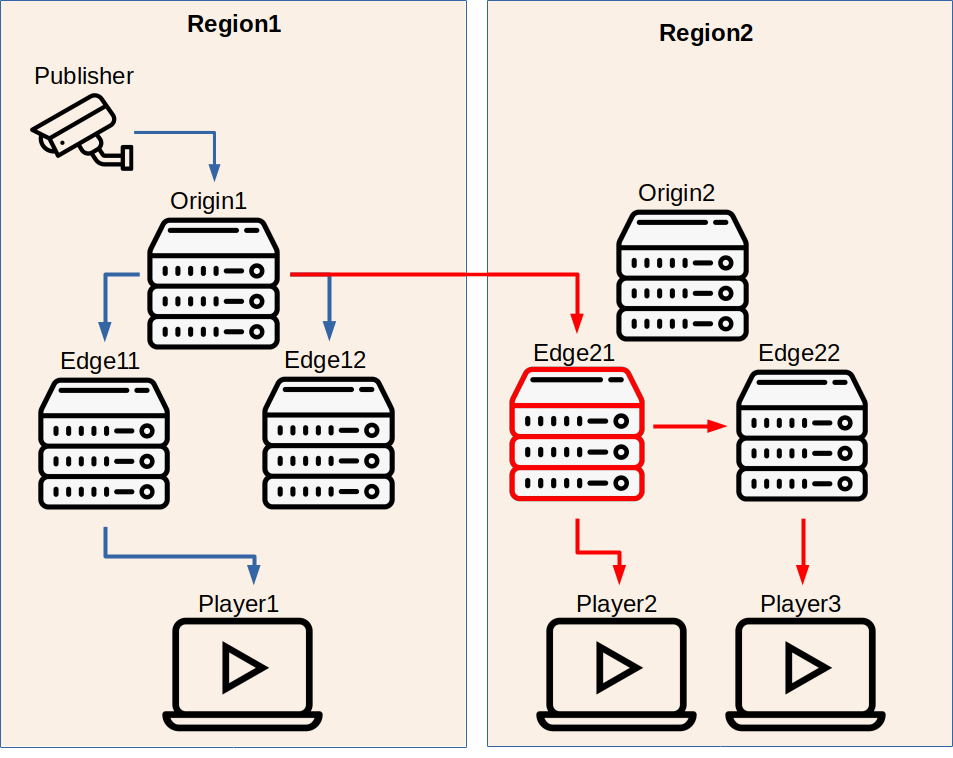

# What is Multi-Level Cluster?
A cluster which has different regions is called Multi-Level Cluster where each region has its own origin for a stream. Ant Media Server can be scaled in different physical locations. You can set the node group parameter of the servers to create regions. Still you can make all nodes be in the same region by setting all node group parameters with the same value or using it with default. But separating the nodes into regions has some advantages in performance. Because each region will have their own origin node for a stream and the edges in a region will pull the stream from the origin of their region.

# How does it work?

Lets clarify the the case with an example scenario. 

* _Publisher_ starts a stream and it is assigned to the Origin1 in the **Region1**.
* Lets say, _Player1_ who is closed to **Region1** requests to play the stream.
* _Player1_ is assigned to **Edge11** in **Region1**.
* Since the **Origin1** is the origin of the stream, **Edge11** will pull stream from **Origin1**.
* Until now, the scenario is one region cluster.
* Lets say, _Player2_ who is closed to **Region2** requests to play the stream.
* _Player2_ is assigned to **Edge21** in **Region2**.
* **Edge21** checks the origin of the stream. Since it is not in its own region (**Region2**) it is assigned as the secondary origin for that stream in **Region2**. It pulls the stream from the **Origin1** (main origin) in **Region1**. Also it is still an edge server so it servers the stream to _Player2_.
* Lets say, _Player3_ who is closed to **Region2** requests to play the stream.
* _Player3_ is assigned to **Edge22** in **Region2**.
* **Edge22** checks the origin of the stream. Since **Edge21** is a secondary origin for the stream, it pulls the stream from **Edge21** and serves to _Player3_.

# How to configure?
You can set the node group (or region) of a server in 2 ways:
### Configuration file (offline)
You can set it as `modeGroup=GROUP_NAME` in `conf/red5.properties` file.
### REST API (online)
You can set it by calling POST Method `AMS_URL/rest/changeServerSettings` and passing node group in JSON format as follows.
`{"nodeGroup":"GROUP_NAME"}`

You should configure the Load Balancer to forward Publish and Play requests to the best region. If you have a global cluster in different geolocations,you should have a Load Balancer like Route53.

