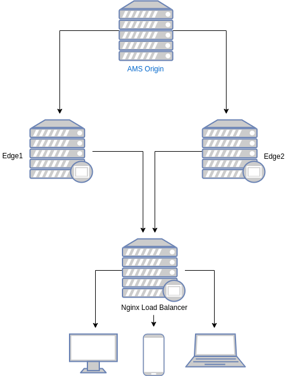

# What is Nginx ?

Nginx started out as an open source web server designed for maximum performance and stability. Today, however, it also serves as a reverse proxy, HTTP load balancer, and email proxy for IMAP, POP3, and SMTP.

## Prerequisites
* One server with Ubuntu 18.04 installed for Nginx Load Balancer
* One server with Ubuntu 18.04 installed for MongoDB Server (Optional)

> This document compatible all Debian based os (Debian, Ubuntu, etc.)
## Installation Steps
1. [Install Nginx](#Nginx-Installation)
2. [Install LetsEncrypt](#Let's-Encrypt-for-Nginx-SSL-Termination)
3. [Nginx Load balancer with SSL termination](#Configure-NGINX-as-a-Load-Balancer)



## Nginx Installation
> We prefer to install latest Nginx version

Install the prerequisites

`sudo apt install curl ca-certificates lsb-release -y`

To set up the apt repository for stable nginx packages, run the following command:
```
echo "deb http://nginx.org/packages/`lsb_release -d | awk '{print $2}' | tr '[:upper:]' '[:lower:]'` `lsb_release -cs` nginx" \
    | sudo tee /etc/apt/sources.list.d/nginx.list
```
import an official nginx signing key

`curl -fsSL https://nginx.org/keys/nginx_signing.key | sudo apt-key add -`

run the following commands to install nginx
```
apt update 
apt install nginx -y
```
### Let's Encrypt for Nginx SSL Termination
run the following commands to install certbot
```
apt install certbot python-certbot-nginx
```
run the following commands to create certificate
```
certbot --nginx -d yourdomain.com -d www.yourdomain.com
```
edit crontab file
`crontab -e`

add below line to renew certificate each 80 days.
`0 0 */80 * * root certbot -q renew --nginx`

## Configure NGINX as a Load Balancer

### Backup default nginx configuration
`mv /etc/nginx/nginx.conf{,_bck}`

create new a nginx.conf file with your favorite editor

`vim /etc/nginx/nginx.conf`

In that file, copy the following contents
```
# RTMP stream configuration
stream {
    upstream stream_backend {
	server AMS_ORIGIN1_IP:1935;
        server AMS_ORIGIN2_IP:1935;
    }
    
    server {
        listen        1935;
        proxy_pass    stream_backend;
        proxy_timeout 3s;
        proxy_connect_timeout 1s;
    }

# If you want to use RTMPS, uncomment the lines below.
#    server {
#        listen 1936 ssl;
#        proxy_pass backend;
#        ssl_certificate /etc/letsencrypt/live/yourdomain/fullchain.pem;
#        ssl_certificate_key /etc/letsencrypt/live/yourdomain/privkey.pem;
#    }
    
}

user nginx;
worker_processes auto;
pid /var/run/nginx.pid;
worker_rlimit_nofile 1048576;

events {
    worker_connections 1048576;
    multi_accept on;
    use epoll;
}

http {
      #Ant Media Origin
      upstream antmedia_origin {
      ip_hash;
      server AMS_ORIGIN1_IP:5080;
      server AMS_ORIGIN2_IP:5080;
    }
    #Ant Media Edge
    upstream antmedia_edge {
      ip_hash;
      server AMS_EDGE1_IP:5080;
      server AMS_EDGE2_IP:5080;
    }

    sendfile on;
    tcp_nopush on;
    tcp_nodelay on;
    server_tokens off;
    keepalive_timeout 300s;
    types_hash_max_size 2048;
    include /etc/nginx/mime.types;
    default_type application/octet-stream;

    # ssl settings
    ssl_protocols TLSv1.2;
    ssl_prefer_server_ciphers on;
    ssl_ciphers         HIGH:!aNULL:!MD5;
    ssl_session_cache shared:SSL:50m;
    ssl_session_tickets off;

    # logs settings
    log_format  main  '$remote_addr - $remote_user [$time_local] "$request" '
                      '$status $body_bytes_sent "$http_referer" '
                      '"$http_user_agent" "$http_x_forwarded_for"'
		              '"$hostname" "upstream: $upstream_addr"';
    access_log /var/log/nginx/access.log;
    error_log /var/log/nginx/error.log;

    # gzip
    gzip on;
    gzip_disable "msie6";
    gzip_http_version 1.1;
    gzip_comp_level 6;
    gzip_types text/plain text/css application/json application/javascript text/javascript application/x-javascript text/xml application/xml application/xml+rss application/vnd.ms-fontobject application/x-font-ttf font/opentype font/x-woff image/svg+xml image/x-icon;

    # proxy settings
    proxy_redirect off;
    proxy_http_version 1.1;
    proxy_read_timeout 10s;
    proxy_send_timeout 10s;
    proxy_connect_timeout 10s;
     
    #redirect all http requests to https
    server {
        listen 80 default_server;
        server_name _;
        return 301 https://$host$request_uri;
    }  

    #Origin Configuration
    server {
            listen 443 ssl;
            ssl_certificate /etc/letsencrypt/live/yourdomain.com/fullchain.pem;
            ssl_certificate_key /etc/letsencrypt/live/yourdomain.com/privkey.pem;
            server_name yourdomain.com;

            location / {
                proxy_pass http://antmedia_origin;
    	    	proxy_http_version 1.1;
                proxy_set_header X-Forwarded-For $proxy_add_x_forwarded_for;
                proxy_set_header Host $host;
                proxy_set_header Upgrade $http_upgrade;
                proxy_set_header Connection "Upgrade";
            }
        }
    
    
    #Edge Configuration
    server {
            listen 5443 ssl;
	        ssl_certificate /etc/letsencrypt/live/yourdomain.com/fullchain.pem;
                ssl_certificate_key /etc/letsencrypt/live/yourdomain.com/privkey.pem;
	        server_name yourdomain.com;

 	        location / {
                proxy_pass http://antmedia_edge;
                proxy_http_version 1.1;
                proxy_connect_timeout 7d;
        	proxy_send_timeout 7d;
		proxy_read_timeout 7d;
                proxy_set_header X-Forwarded-For $proxy_add_x_forwarded_for;
                proxy_set_header Host $host;
                proxy_set_header Upgrade $http_upgrade;
                proxy_set_header Connection "Upgrade";
            }
        }

}

```
Save and close that file.

On our server, we have to remove the symbolic link to default, in the /etc/nginx/sites-enabled folder.

`sudo rm /etc/nginx/sites-enabled/default`

Check your configuration for any Error using the following command.

`nginx -t`

And Finally Enable and Restart nginx service
```
systemctl enable nginx
systemctl restart nginx
```