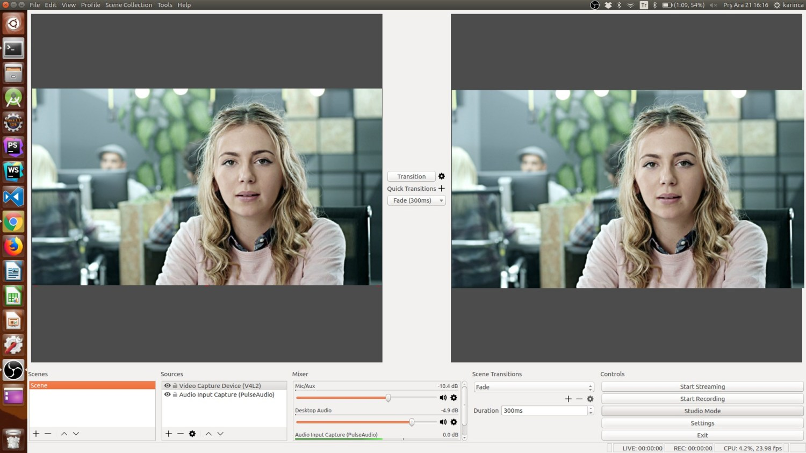
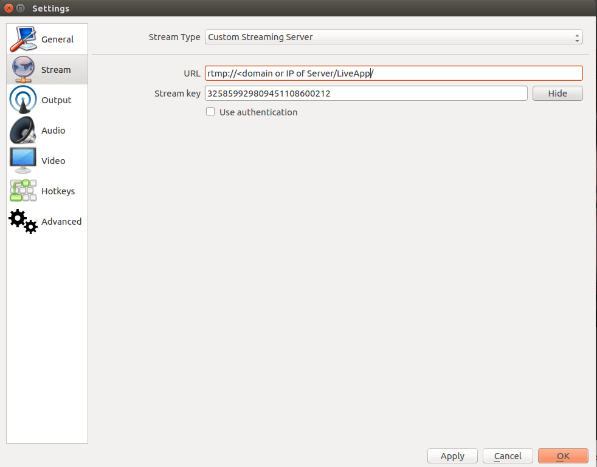
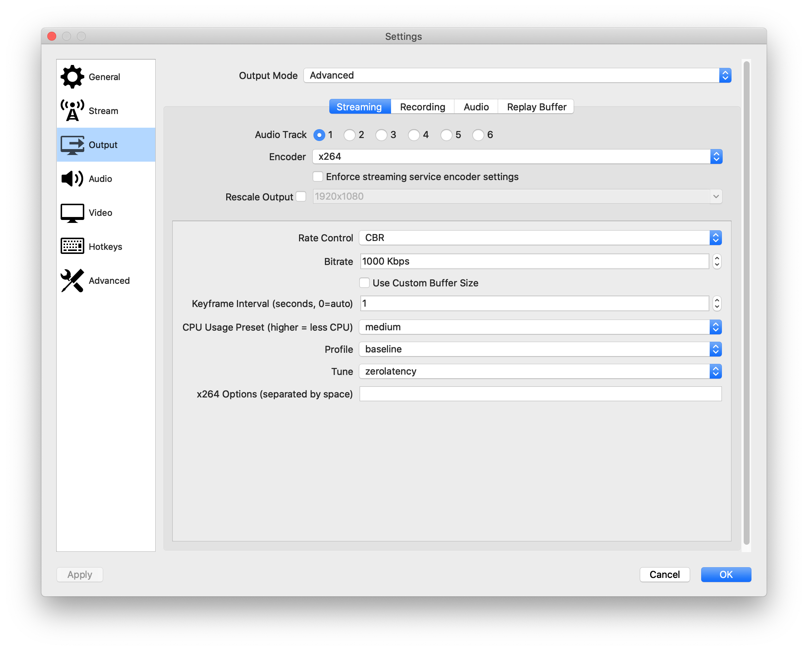
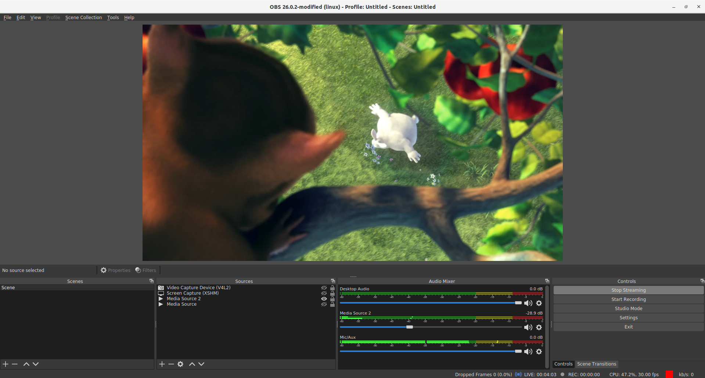
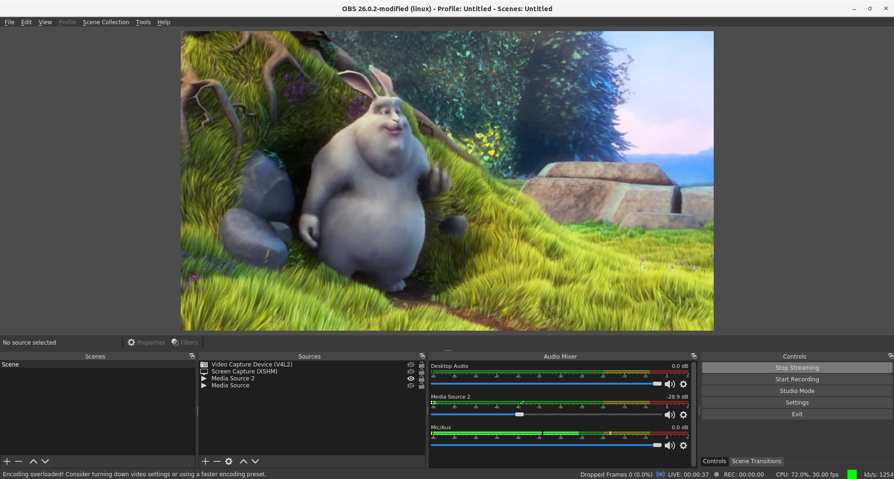

# Publish with a Desktop Software - Open Broadcaster Software 

OBS(Open Broadcaster Software) is free and open source software for video recording and live streaming. You can use either your PC’s embedded camera or externally connected camera as a video source with OBS. Sound sources also can be configured. 

Let’s have a look at step by step how to use OBS for streaming:

### 1. Install the OBS 
Download Open Broadcaster Software from [obsproject.com](https://obsproject.com/) and Install it. There are distributions for Windows, Mac and Linux.

### 2. Provide Sources
Open the OBS and by default OBS starts to capture from your built-in camera if exists. You can add or remove video/audio source from Sources section. OBS is very powerful tool and it has many features. You can google about [getting professional with OBS](https://www.google.com/search?q=getting+professional+with+OBS)

### 3. Configure OBS
We're assuming that your Ant Media Server accepts all streams. (There is no any security option enabled.)

* Click `Settings` in the OBS Window and then Select `Stream` on the left side menu
* Choose `Custom Streaming Server` in the `Stream Type` dropdown menu.
* In the URL box, type your RTMP URL without stream id. It's like `rtmp://your_server_domain_name/LiveApp`
* In the Stream key, you can write any stream id because we assume that no security option is enabled. 

 

**When you're using tokens** you need to generate a publish token and use it in this format inside the stream key : `streamdid?token=tokenid`

#### Tune for Ultra Low Latency Streaming
OBS by default is not optimized for ultra low latency streaming. If you push RTMP stream with OBS and play with WebRTC, please open `Settings > Output` and make the rate control `CBR(Constant Bitrate)` and Tune for `zerolatency`.  Secondly, you can configure the bitrate according to your quality and internet bandwidth requirements. Also, `keyframe interval` should be adjusted to 1.

**Please keep in mind** that if your network is not stable to send requested bitrate all the time, you'll see **freezes** in playing the stream.  

### 4: Start Streaming
Close `Settings` window and just click the “Start Streaming” button in the main window of OBS.

Congrats. You're publishing Live Stream with OBS. 

> Quick Link: [Learn How to Play Live Streams](Playing-Live-Streams)

### Troubleshooting OBS Guide

If you want to stream smoothly, you need to check some parameters in OBS Settings. These parameters tell you for your errors. 

**Stream Health**

Stream health parameters are located at the bottom right. You need to check `Dropped Frames`, `CPU` and `Stream health color`.

* **Dropped Frames**: This parameter should 0. If you have an issue with Dropped Frames, you can decrease your FPS or Bitrate parameters. Default parameter: `0 (0.0%)`
* **CPU**: CPU parameter is important for streaming. We recommend that it not exceed 70%.
* **Stream health color**: This color should green. If this color is not green, you can realize something wrong in settings. Default parameter: `Green`

**OBS Encoding Overloaded**

It means your settings are too high for your PC to handle. Different hardware and software combinations result in different thresholds for "how high" you can go. You can drop their resolution, bitrate, and use some of the fastest presets.

> Quick Link: [OBS Encoding Overloaded](https://obsproject.com/wiki/General-Performance-and-Encoding-Issues)

**Recorded VOD Files Stream**

If you want to stream your VOD files, please consider your VOD encoder settings as below:

* **Profile**: `Baseline`
* **Tune**: `Zerolatency`

You can change your VOD encoder settings as below FFmpeg command:

`ffmpeg -i input.mp4 -profile baseline -tune zerolatency output.mp4`