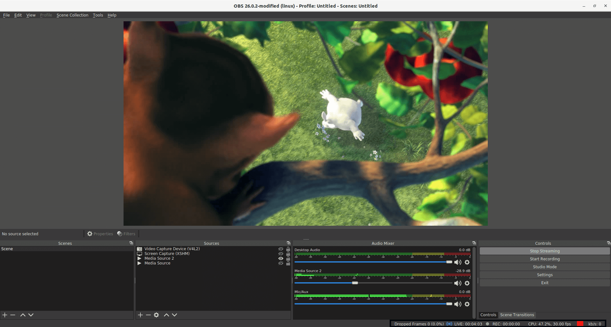

# Publish with a Desktop Software - Open Broadcaster Software 

OBS(Open Broadcaster Software) is free and open source software for video recording and live streaming. You can use either your PC’s embedded camera or externally connected camera as a video source with OBS. Sound sources also can be configured. 

Let’s have a look at step by step how to use OBS for streaming:

### 1. Install the OBS 
Download Open Broadcaster Software from [obsproject.com](https://obsproject.com/) and Install it. There are distributions for Windows, Mac and Linux.

### 2. Provide Sources
Open the OBS and by default OBS starts to capture from your built-in camera if exists. You can add or remove video/audio source from Sources section. OBS is very powerful tool and it has many features. You can google about [getting professional with OBS](https://www.google.com/search?q=getting+professional+with+OBS)

### 3. Configure OBS
We're assuming that your Ant Media Server accepts all streams. (There is no any security option enabled.)

* Click `Settings` in the OBS Window and then Select `Stream` on the left side menu
* Choose `Custom Streaming Server` in the `Stream Type` dropdown menu.
* In the URL box, type your RTMP URL without stream id. It's like `rtmp://your_server_domain_name/LiveApp`
* In the Stream key, you can write any stream id because we assume that no security option is enabled. 

 

**When you're using tokens** you need to generate a publish token and use it in this format inside the stream key : `streamdid?token=tokenid`

#### Tune for Ultra Low Latency Streaming
OBS by default is not optimized for ultra low latency streaming. If you push RTMP stream with OBS and play with WebRTC, please open `Settings > Output` and make the rate control `CBR(Constant Bitrate)` and Tune for `zerolatency`.  Secondly, you can configure the bitrate according to your quality and internet bandwidth requirements. Also, `keyframe interval` should be adjusted to 1.

**Please keep in mind** that if your network is not stable to send requested bitrate all the time, you'll see **freezes** in playing the stream.  

### 4: Start Streaming
Close `Settings` window and just click the “Start Streaming” button in the main window of OBS.

Congrats. You're publishing Live Stream with OBS. 

> Quick Link: [Learn How to Play Live Streams](Playing-Live-Streams)

### Troubleshooting

If you have have problems with stream quality, you should check the following indicators in OBS.

**Stream Health**

Stream health parameters are located at the bottom right. There are 3 stream health parameters: `Dropped Frames`, `CPU` and `Stream health color`.

* **Dropped Frames**: This value should be 0. If it is increasing, you may decrease your FPS or Bitrate parameters in OBS settings.
* **CPU**: CPU value is important for streaming quality. We recommend that it shouldn't exceed 70%.
* **Stream health color**: This color should be green. If it has a color between yellow and red you may have problems in your stream quality.

**OBS Encoding Overloaded Warning**

This warning appears in bottom left when your settings are too high for your PC to handle. Because OBS makes transcoding and this consumes CPU power. According to the hardware and software combinations, stream parameters are limited. If your PC cannot handle the stream with parameters you set, this warning appears. You may drop the resolution, bitrate, or change encoder preset value to one with high speed and low quality.

> Quick Link: [OBS Encoding Overloaded](https://obsproject.com/wiki/General-Performance-and-Encoding-Issues)

**Recorded VoD Files Stream**

If you want to stream your VoD files, please consider your VoD encoder settings as below:

* **Profile**: `Baseline`
* **Tune**: `Zerolatency`

You can change your VoD encoder settings as below:

`ffmpeg -i input.mp4 -profile baseline -tune zerolatency output.mp4`