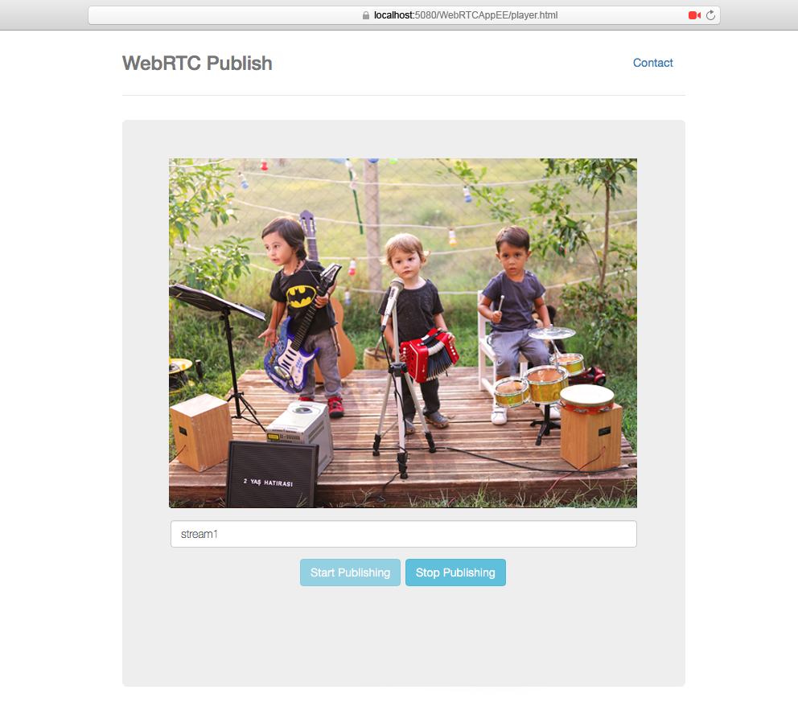
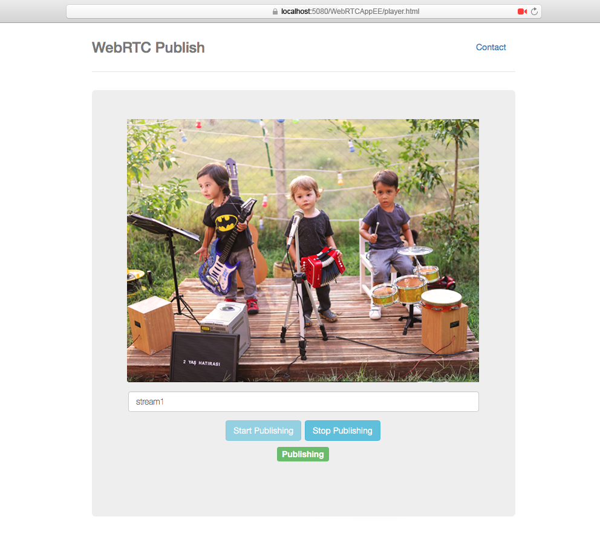
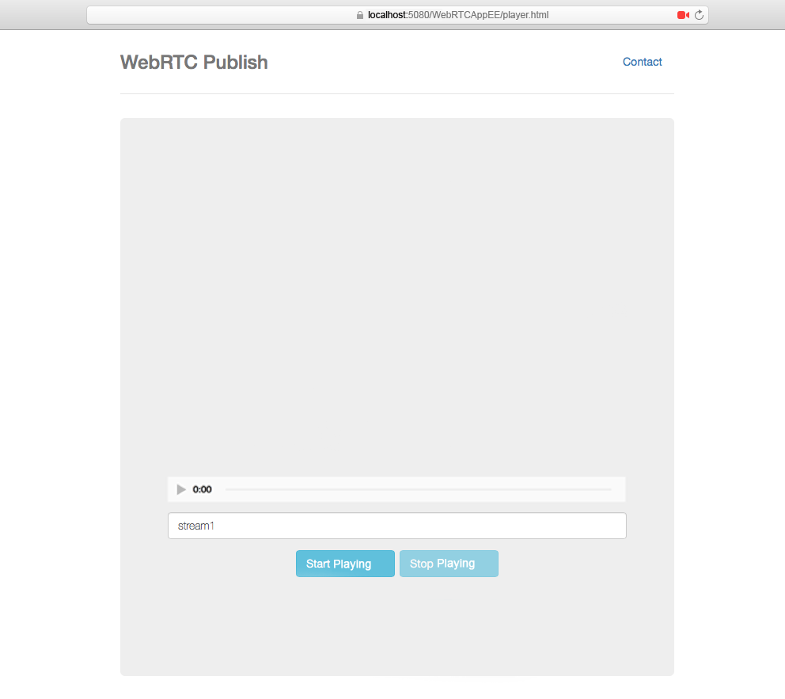
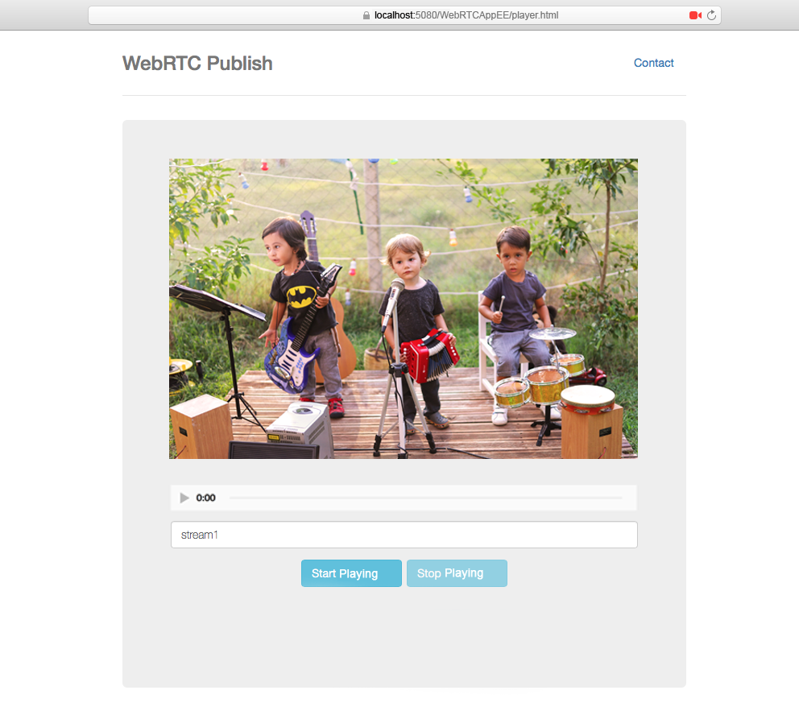

### Step 3: Configure the Ant Media Server

Contact with us from [contact form](https://antmedia.io/#contacts) in order to try Ant Media Server Enterprise Edition. Extract the Ant Media Server Enterprise zip file and start the server with start.sh command in the terminal. For detailed information please follow steps described in the [Getting Started](https://github.com/ant-media/Ant-Media-Server/wiki/Getting-Started).
```
cd /path/to/ant-media-server

./start.sh
```

After that, you need to create a live stream on Ant Media Server Enterprise Management console. You can reach it at `http://<server-address>:5080` address, then click `WebRTCAppEE` from Applications section and `New Live Stream`. The server creates a live stream with an unique ID with the format of `rtmp://<server-address>/WebRTCAppEE/325859929809451108600212`. You can copy this url with clicking clipboard icon.
 

Ant Media Server Dashboard

### Step 5 : Start Stream and Watch 🙂

Close settings window and just click the `Start Streaming` button in the main window of OBS. You can watch WebRTC stream from either Ant Media Management console or other platforms such as VLC player with same RTMP URL.

To Play with WebRTC, go to `http://<server-address>:5080/WebRTCAppEE/player.html` and enter the stream key parameter and click "Start Playing" button.


You can also play on Ant Media Management console which plays via HLS at about 8-10 seconds latency. A dialog will be displayed where you can watch the live stream.


In order to reduce latency in RTMP streaming, please [follow the instructions here](https://github.com/ant-media/Ant-Media-Server/wiki/How-to-Reduce-Latency-in-RTMP-to-HLS%3F)

Ant Media Server 1.2.0+ Enterprise Edition supports adaptive low latency WebRTC streaming. 

In addition, Ant Media Server can
* Record WebRTC streams as MP4 and MKV
* Convert WebRTC streams to adaptive live HLS
* Create previews in PNG format from WebRTC streams

We hope this tutorial will be helpful for you 🙂 please feel free in case you have any question, just send an email (contact at antmedia.io) or contact with us from contact page.

## Download

Firstly, you need to have Ant Media Server Enterprise Edition. If you are a personal user and just want to try,
contact with us at [antmedia.io](https://antmedia.io). We will reply back by providing Ant Media Server Enterprise Edition to try. 

If you are a professional user and need support, you can buy support at [antmedia.io](https://antmedia.io) as well


## Quick Start

*Ant Media Server 1.2.0+ runs on Linux and Mac not on Windows.* 

Let's start, we assume that you have got Enterprise Edition somehow and downloaded to your local computer. 

1. Follow the instructions on [Getting Started] for installation (https://github.com/ant-media/Ant-Media-Server/wiki/Getting-Started). 

 
2. Open the browser(Chrome or Firefox) and go to the `http://localhost:5080/WebRTCAppEE`. 
    Let browser access your camera and mic unless it cannot send WebRTC Stream to the server.


WebRTCAppEE stands for WebRTCApp Enterprise Edition
   
3. Write stream name or leave it as default and Press `Start Publishing` button. After you press the button, 
    "Publishing" blinking text should appear.


   

4. Go to the `http://localhost:5080/WebRTCAppEE/player.html`



5. Press `Start Play` button. After you press the button, webrtc stream should be started.



6. Open `http://localhost:5080/WebRTCAppEE/player.html` in other tabs and Press `Start Playing` button again 
   to check how it plays and what the latency is. 
   
## Running on Remote Instances - Enable SSL For Ant Media Server Enterprise
If you are running the Ant Media Server Enterprise Edition in remote computer/instances, you may need SSL. If so, please follow the Enable SSL doc or [this blog post](https://antmedia.io/enable-ssl-on-ant-media-server/).


## Feedbacks

Please let us know your feedbacks about the latency and streaming or any other issue you have faced 
so that we can improve and let you try and use.

You can use contact form at [antmedia.io](https://antmedia.io) or `contact at antmedia dot io` e-mail to send your feedbacks

Thank you