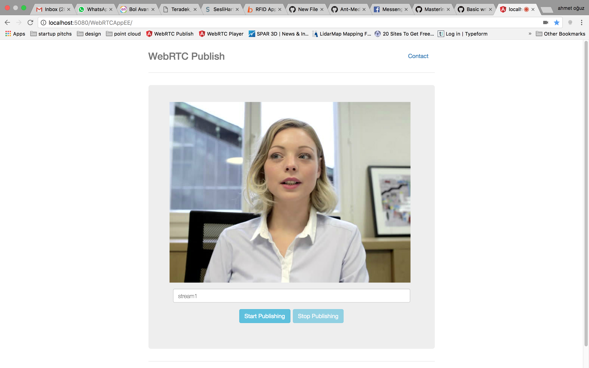
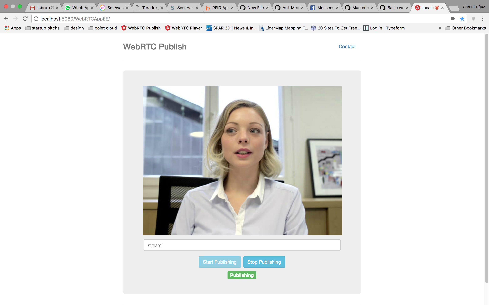
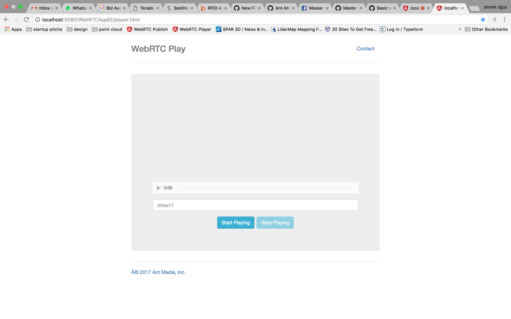
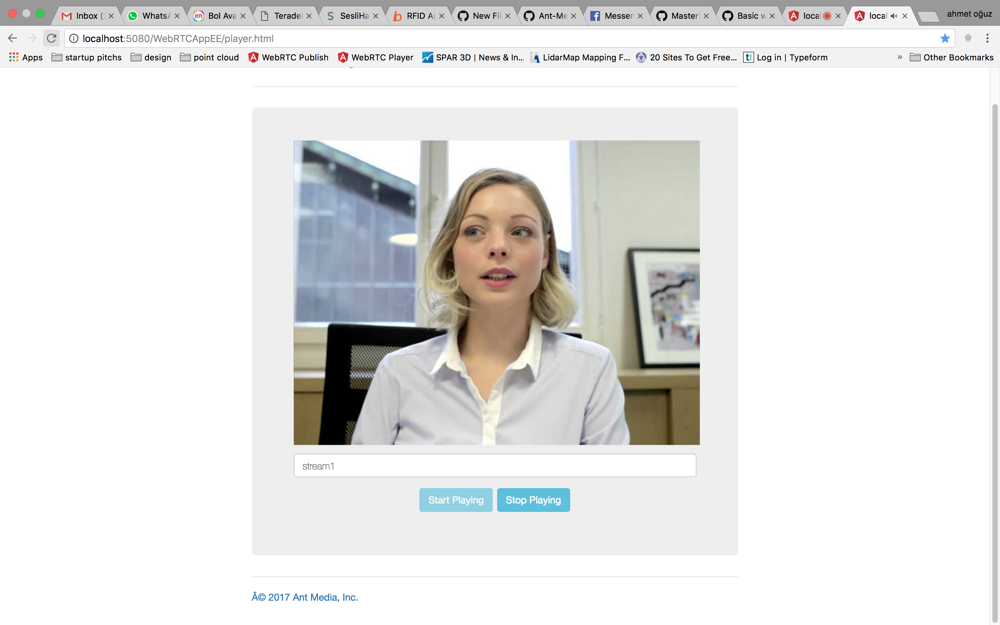

Quick start guide lets you set up Ant Media Server(AMS) Enterprise and try Ultra-Low Latency Streaming in a few mins.
The installation procedure for Ant Media Server Community and Enterprise Editions are same so that you can install community edition by following this instructions as well.   

## Get Started
There are 2 options to start an Ant Media Server (AMS).
1. Install to your local ubuntu box(localhost)
2. Install to a remote server with Public IP Address

> Quick launch in [AWS](https://aws.amazon.com/marketplace/search/results?x=0&y=0&searchTerms=Ant+Media+Server&page=1&ref_=nav_search_box) or [Azure](https://azuremarketplace.microsoft.com/en-us/marketplace/apps?search=Ant%20Media%20Server&page=1) or [DigitalOcean](https://marketplace.digitalocean.com/apps/ant-media-server-enterprise-edition)

### 1. Download Ant Media Server
You can download Ant Media Server Enterprise at [antmedia.io](https://antmedia.io). 
If you want to try Community Edition, you can download at [github.com](https://github.com/ant-media/Ant-Media-Server)
After the download, you will have a compressed file that contains the Ant Media Server. 

### 2. Install your Ant Media Server

Open a terminal and go to the directory where you download the Ant Media Server.
````
cd /path/to/where/ant-media-server/is/downloaded
````
Get the `install_ant-media-server.sh` script.
```
wget https://raw.githubusercontent.com/ant-media/Scripts/master/install_ant-media-server.sh 
chmod 755 install_ant-media-server.sh
```
Install Ant Media Server(AMS) as follows. Please don't forget to replace `[ANT_MEDIA_SERVER_INSTALLATION_FILE]` below with the downloaded file at step 1. 
```
sudo ./install_ant-media-server.sh [ANT_MEDIA_SERVER_DOWNLOADED_FILE] 
```

### 3. Install SSL for your Ant Media Server
> If you're installing on your localhost, you can skip this step. 

Please make sure that your server instance has Public IP address and a domain is assigned to its Public IP address. Then go to the folder where Ant Media Server is installed. Default directory is `/usr/local/antmedia`
```` 
cd /usr/local/antmedia
````
Run `./enable_ssl.sh` script in AMS installation directory. Please don't forget to replace `{DOMAIN_NAME}` with your domain name.
````
sudo ./enable_ssl.sh -d {DOMAIN_NAME}
````

For detailed information about SSL, follow [SSL Setup](SSL-Setup).

### 3. Ultra-Low Latency Publishing/Playing

Ant Media Server Enterprise provides 0.5 seconds end-to-end latency. So let's try ultra-low latency 
#### Publishing
* Visit the page `https://your-domain-address.com:5443/WebRTCAppEE/`. 
> If you're running in localhost, please visit `http://localhost:5080/WebRTCAppEE/`
* Let browser access the camera and mic. Then click `Start Publishing` 
 
* After you press the button,  "Publishing" blinking text should appear

    

#### Playing
* Visit the page `https://your-domain-address.com:5443/WebRTCAppEE/player.html`. 
> If you're running in localhost, please visit `http://localhost:5080/WebRTCAppEE/player.html`
* Write the stream id in text box( `stream1` by default)
 
* Press `Start Play` button. After you press the button, WebRTC stream starts playing
 

> Note: Don't forget that the `stream id` on the publish and play pages should be the same.


This quick start lets your try Ultra-Low Latency streaming in Ant Media Server. If you have any problem, don't be hesitate to [contact us](https://antmedia.io/#contact).  