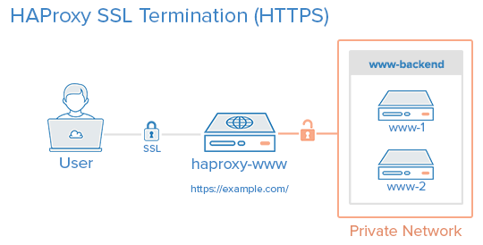
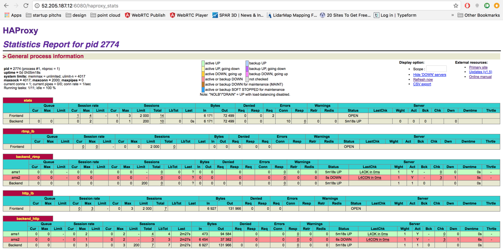

Ant Media Server can run in cluster mode which means number of Ant Media Server instances(nodes) can work together to scale number of viewers and publishers. In other words, you can publish a live stream to one node of Ant Media Server in the cluster and you can watch the stream in another node in the cluster.

  

Ant Media Server Cluster has mainly four components. 
1. **Database(MongoDB):** Stream information is recorded to database(MongoDB) to let all nodes access the data. Stream information contains the bitrates, settings, origin node of the stream, etc. 

2. **Origin Group:** This group consists of Ant Media Server nodes which ingest streams and do the necessary actions such as transcoding, transmuxing, etc. Nodes in origin group distribute the streams to the nodes in the edge group. Viewers should not get connected to the nodes in the origin group to play the streams. Nodes in the origin group generally can have GPU if adaptive bitrates are enabled in the cluster.    

3. **Edge Group:** This group consists of Ant Media Server nodes which get streams from nodes in the origin group and send to the viewers. Nodes in this group should not ingest stream and these nodes does not perform any actions like transcoding or transmuxing. They only get the stream from origin and send it to the viewers.  
 
4. **Load Balancer:** This component is the frontend for the viewers and publishers. It receives the request from the users and forwards the request to a node in the origin or edge group. It balances the incoming load into the nodes running in the backend. 


To run Ant Media Server in Clustering please follow these steps.

## 1. Installing Database(MongoDB)
You can install MongoDB to an instance or even you can make cluster installation for MongoDB. In this documentation, we explain how to install MongoDB to a Ubuntu 16.04 and Ubuntu 18.04
 
* Connect your instance and Run the following commands in the shell 
```
wget -qO - https://www.mongodb.org/static/pgp/server-4.2.asc | sudo apt-key add -
echo "deb [ arch=amd64 ] https://repo.mongodb.org/apt/ubuntu `lsb_release -cs`/mongodb-org/4.2 multiverse" | sudo tee /etc/apt/sources.list.d/mongodb-org-4.2.list
sudo apt-get update
sudo apt-get install -y mongodb-org
```
* Set `bind_ip` value as `0.0.0.0` in `/etc/mongod.conf` file to let MongoDB accept connections from other nodes. 
  
  _0.0.0.0 means `listen on every available network interface`. If you don't have a firewall, you will accept all connection from everywhere to your MongoDB server. We recommend adding security credentials to your MongoDB instance with following commands._

  * Connect to the MongoDB shell
  ```
  mongo
  ```
  * Create admin user and password (please change the values for `user` and `pwd` fields)
  ```
  use admin

  db.createUser(
      {
          user: "superadmin",
          pwd: "admin",
          roles: [ "root" ]
      }
  )
  ```
  * Enable security in MongoDB confiruation 
  ```
  sed -i 's/#security:/security:\n  authorization: "enabled"/g' /etc/mongod.conf
  ```
  * Finally restart mongod service
  ```
  systemctl restart mongod 
  ```
* Enable MongoDB start at boot
````
sudo systemctl enable mongod.service
````
* Restart MongoDB 
```
sudo systemctl restart mongod
```

## 2. Installing Origin Group and Edge Group

You can easily switch Ant Media Server mode from `standalone` mode to `cluster` mode or vice versa. Let's switch running standalone Ant Media Server to cluster mode.  In order to make Ant Media Server to run in Cluster mode, you just need to run the following command.

````
cd /usr/local/antmedia
sudo ./change_server_mode.sh cluster <MONGODB_SERVER_IP>
````
> Note: If you set username and password authentication on MongoDB, you should run `change_server_mode.sh` as follow.
````
sudo ./change_server_mode.sh cluster <MONGODB_SERVER_IP> <MONGODB_USERNAME> <MONGODB_PASSWORD>
````

You can monitor all nodes in the cluster by visiting the web page below in any node.
````
http://<ANT_MEDIA_SERVER_NODE_IP>:5080/#/cluster
````


#### Basics of Clustering
* Each instance register itself to the MongoDB.
* When an instance starts receiving a live stream, it register itself as the origin of the stream.
* When the load balancer forwards a play request to any of the nodes in the edge group
  * Node gets the stream origin from MongoDB
  * Node fetches live stream from the origin node
  * Distribute stream to the viewers

Important Note: You need to open this TCP port range(TCP:5000-65000) for the internal network. It should not be open to public 

For any case, if you want to return back to standalone mode, just run the following command
````
cd /usr/local/antmedia
sudo ./change_server_mode.sh standalone
````
## 3. Installing Load Balancer(HAProxy)

Load Balancer is the sister of cluster so If you make Ant Media Server instances run in Cluster Mode. Then a load balancer will be required to balance the load. In this documentation, you will learn how to install HAProxy Load Balancer with SSL termination.



The configuration below balances RTMP, HLS, HTTP/HTTPS and WebSocket(WS/WSS) connections so that it will be used for RTMP, HLS and WebRTC streaming.

### HAProxy Installation

Run the commands below to install HAProxy
```
sudo apt-get install software-properties-common -y
sudo add-apt-repository ppa:vbernat/haproxy-2.0
sudo apt-get update
sudo apt-get install haproxy=2.0.\*
```
### SSL Certificate Installation

  *  Install the `certbot` 
  ```
  sudo apt-get update
  sudo apt-get install software-properties-common
  sudo add-apt-repository ppa:certbot/certbot
  sudo apt-get update
  sudo apt-get install certbot
  ```
  * Get the Certificate

  Please change `example.com` with your domain name
  ````
  sudo certbot certonly --standalone -d example.com -d www.example.com
  ````

  * Combine `fullchain.pem` and `privkey.pem` and save it to `/etc/haproxy/certs` folder
  ```
  sudo mkdir -p /etc/haproxy/certs
  DOMAIN='example.com' 
  sudo -E bash -c 'cat /etc/letsencrypt/live/$DOMAIN/fullchain.pem /etc/letsencrypt/live/$DOMAIN/privkey.pem > /etc/haproxy/certs/$DOMAIN.pem'
  sudo chmod -R go-rwx /etc/haproxy/certs
  ```
  Right now required pem file is ready under `/etc/haproxy/certs` folder to let HAProxy use. 

### Configuring HAProxy

  * Backup the default configuration file
  ```
  mv /etc/haproxy/haproxy.cfg{,_backup}
  ```

  * Create and edit new configuration file
  ```
  nano /etc/haproxy/haproxy.cfg
  ```

  * Add global and default parameters to configuration `/etc/haproxy/haproxy.cfg`
  ```
  global
      log 127.0.0.1 local0 notice
      maxconn 2000
      user haproxy
      group haproxy
  defaults
      log global
      mode http
      option forwardfor
      option http-server-close
      option httplog
      option dontlognull
      timeout connect 5000
      timeout client  5000
      timeout server  5000
      timeout tunnel  2h  #this is for websocket connections, 2 hours inactivity timeout
      timeout client-fin 5000
      errorfile 400 /etc/haproxy/errors/400.http
      errorfile 403 /etc/haproxy/errors/403.http
      errorfile 408 /etc/haproxy/errors/408.http 
      errorfile 500 /etc/haproxy/errors/500.http
      errorfile 502 /etc/haproxy/errors/502.http
      errorfile 503 /etc/haproxy/errors/503.http
      errorfile 504 /etc/haproxy/errors/504.http
  ```
  The configuration above makes maximum number of connections to 2000. Please change it according to your 
 hardware and cluster size.

  * Add Monitoring Parameters
  Please change `Username` and `Password`. You can use these parameters while entering the monitor panel
  ```
  listen stats # Define a listen section called "stats"
    bind :6080 
    mode http
    stats enable  # Enable stats page
    stats hide-version  # Hide HAProxy version
    stats realm Haproxy\ Statistics  # Title text for popup window
    stats uri /haproxy_stats  # Stats URI
    stats auth Username:Password  # Authentication credentials
  ```
  With the configuration above you can visit `http://HAPROXY_LB:6080/haproxy_stats` URL to monitor the HAProxy

  * RTMP Load Balancing
  ```
  frontend rtmp_lb
      bind *:1935 
      mode tcp
      default_backend backend_rtmp

  backend backend_rtmp
      mode tcp
      server ams1 172.30.0.42:1935 check  # Ant Media Server instance 1
      server ams2 172.30.0.48:1935 check  # Ant Media Server instance 2
      # you can add more instances 
  ```
  * HTTP Load Balancing
  ```
  frontend http_lb
    bind *:80
    bind *:5080
    mode http
    reqadd X-Forwarded-Proto:\ http
    default_backend backend_http
  ```
  * HTTPS Load Balancing
  ```
  frontend frontend_https
    bind *:443 ssl crt  /etc/haproxy/certs/$DOMAIN.pem
    bind *:5443 ssl crt /etc/haproxy/certs/$DOMAIN.pem
    reqadd X-Forwarded-Proto:\ https
    default_backend backend_http
  ```
  * Backend Servers
  ```
  backend backend_http
    # below line forwards http requests to https, if you do not have SSL termination, remove it
    redirect scheme https if ! { ssl_fc }  
    # below line provides session stickiness
    cookie JSESSIONID prefix nocache  
    server ams1 172.30.0.42:5080 check cookie ams1  #if you do not use session stickiness, remove cookie ams1
    server ams2 172.30.0.42:5080 check cookie ams2  #if you do not use session stickiness, remove cookie ams2
    # you can add more instances 
  ```


### Starting HAProxy

When everything is complete, restart the HAProxy

```
systemctl restart haproxy
```

and you can view status of the instance through `http://HAPROXY_LB:6080/haproxy_stats` URL




