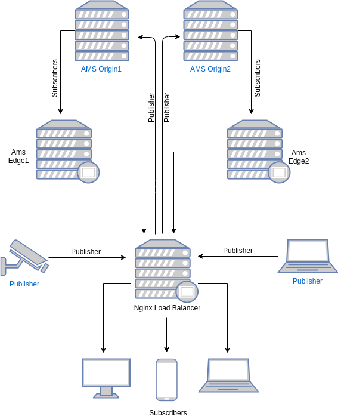

Ant Media Server can run in cluster mode which means number of Ant Media Server instances(nodes) can work together to scale number of viewers and publishers. In other words, you can publish a live stream to one node of Ant Media Server in the cluster and you can watch the stream in another node in the cluster.

  

Ant Media Server Cluster has mainly four components. 
1. **Database(MongoDB):** Stream information is recorded to database(MongoDB) to let all nodes access the data. Stream information contains the bitrates, settings, origin node of the stream, etc. 

2. **Origin Group:** This group consists of Ant Media Server nodes which ingest streams and do the necessary actions such as transcoding, transmuxing, etc. Nodes in origin group distribute the streams to the nodes in the edge group. Viewers should not get connected to the nodes in the origin group to play the streams. Nodes in the origin group generally can have GPU if adaptive bitrates are enabled in the cluster.    

3. **Edge Group:** This group consists of Ant Media Server nodes which get streams from nodes in the origin group and send to the viewers. Nodes in this group should not ingest stream and these nodes does not perform any actions like transcoding or transmuxing. They only get the stream from origin and send it to the viewers.  
 
4. **Load Balancer:** This component is the frontend for the viewers and publishers. It receives the request from the users and forwards the request to a node in the origin or edge group. It balances the incoming load into the nodes running in the backend. 


To run Ant Media Server in Clustering please follow these steps.

## 1. Installing Database(MongoDB)
You can install MongoDB to an instance or even you can make cluster installation for MongoDB. In this documentation, we explain how to install MongoDB to a Ubuntu 16.04 and Ubuntu 18.04
 
* Connect your instance and Run the following commands in the shell 
```
wget -qO - https://www.mongodb.org/static/pgp/server-4.2.asc | sudo apt-key add -
echo "deb [ arch=amd64 ] https://repo.mongodb.org/apt/ubuntu `lsb_release -cs`/mongodb-org/4.2 multiverse" | sudo tee /etc/apt/sources.list.d/mongodb-org-4.2.list
sudo apt-get update
sudo apt-get install -y mongodb-org
```
* Set `bind_ip` value as `0.0.0.0` in `/etc/mongod.conf` file to let MongoDB accept connections from other nodes. 
  
  _0.0.0.0 means `listen on every available network interface`. If you don't have a firewall, you will accept all connection from everywhere to your MongoDB server. We recommend adding security credentials to your MongoDB instance with following commands._

  * Connect to the MongoDB shell
  ```
  mongo
  ```
  * Create admin user and password (please change the values for `user` and `pwd` fields)
  ```
  use admin

  db.createUser(
      {
          user: "superadmin",
          pwd: "admin",
          roles: [ "root" ]
      }
  )
  ```
  * Enable security in MongoDB confiruation 
  ```
  sed -i 's/#security:/security:\n  authorization: "enabled"/g' /etc/mongod.conf
  ```
  * Finally restart mongod service
  ```
  systemctl restart mongod 
  ```
* Enable MongoDB start at boot
````
sudo systemctl enable mongod.service
````
* Restart MongoDB 
```
sudo systemctl restart mongod
```

## 2. Installing Origin Group and Edge Group

You can easily switch Ant Media Server mode from `standalone` mode to `cluster` mode or vice versa. Let's switch running standalone Ant Media Server to cluster mode.  In order to make Ant Media Server to run in Cluster mode, you just need to run the following command.

````
cd /usr/local/antmedia
sudo ./change_server_mode.sh cluster <MONGODB_SERVER_IP>
````
> Note: If you set username and password authentication on MongoDB, you should run `change_server_mode.sh` as follow.
````
sudo ./change_server_mode.sh cluster <MONGODB_SERVER_IP> <MONGODB_USERNAME> <MONGODB_PASSWORD>
````

You can monitor all nodes in the cluster by visiting the web page below in any node.
````
http://<ANT_MEDIA_SERVER_NODE_IP>:5080/#/cluster
````


#### Basics of Clustering
* Each instance register itself to the MongoDB.
* When an instance starts receiving a live stream, it register itself as the origin of the stream.
* When the load balancer forwards a play request to any of the nodes in the edge group
  * Node gets the stream origin from MongoDB
  * Node fetches live stream from the origin node
  * Distribute stream to the viewers

Important Note: You need to open TCP port range(TCP:5000-65000) for the internal network. It should not be open to public.

For any case, if you want to return back to standalone mode, just run the following command
````
cd /usr/local/antmedia
sudo ./change_server_mode.sh standalone
````
## 3. Installing Load Balancer

For the Load Balancer, we have 2 choices. We are using Nginx Load Balancer as default. By the way, you can also use HAProxy for the Load Balancer. Here are the both of selection docs:

1. [Nginx Load Balancer](Nginx-Load-Balancer)
2. [HAProxy Load Balancer](Nginx-Load-Balancer)