In this document, we’re going to tell how to setup a Scalable Ant Media Server Cluster in Amazon Web Services. 

Let’s get started how to start your own scalable ultra low latency streaming service on AWS.


Let me give some brief definitions.

* **MongoDB Database Server:** Ant Media Server uses MongoDB in clustering. Streams information are saved to MongoDB so that edge instances can learn any stream’s origin node.
* **Load Balancer:**  LB is the entrance point for the publishers and players. Load Balancer accepts the requests from publishers or players and forwards the requests to the available node in the cluster.
* **Origin Auto-Scalable Group:** Nodes(Instances) in the origin group accepts the publish requests and ingest the incoming WebRTC stream. When an origin instance accepts a WebRTC stream, it saves the related information to the MongoDB Database Server.
There may be one node or multiple node in origin group. It may even be manually or auto scalable. In our deployment, it’s auto-scalable in AWS.
* **Edge Auto-Scalable Group:** Node(Instances) in the edge group accepts the play requests. Then it learns from MongoDB which origin node has the related stream. After that it gets the stream from related origin node and sends the stream to the player.

Right now let’s start with installing MongoDB Server

## Step 1: Install MongoDB Server

The procedure below shows how to start an instance in AWS EC2 service as well. In other words, if you have no experience about AWS, you can even install MongoDB Server as follows. If you know how to start an instance in AWS, just skip to “Install MongoDB to Your Instance”

* [Signup](https://aws.amazon.com/) to AWS if you don’t have an account yet.  Login to [AWS Management Console](https://console.aws.amazon.com/). Then click EC2 Service as shown in the image below.

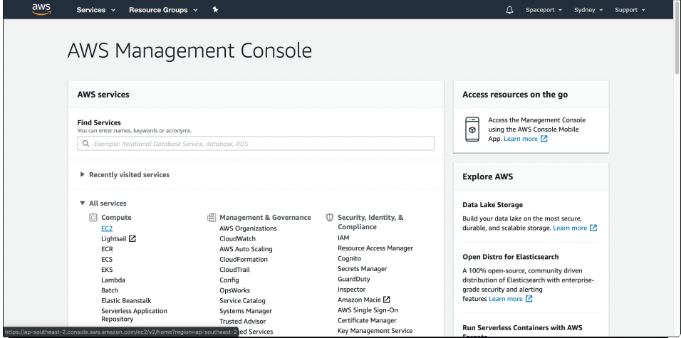

* Click “Launch” Instance.

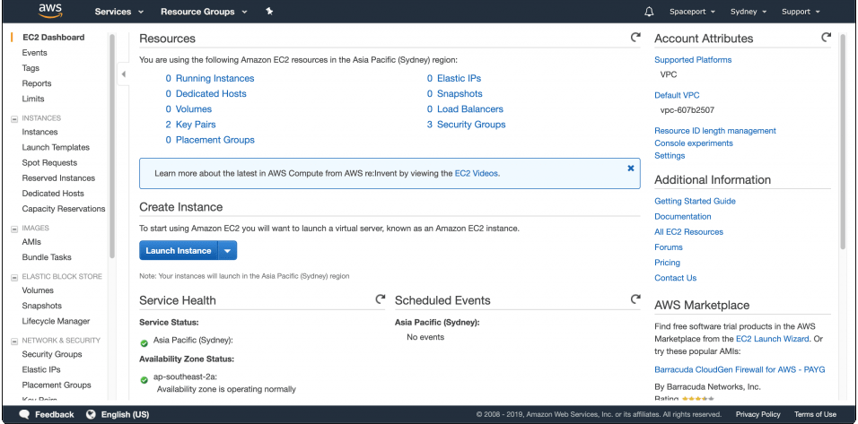

* Search for “Ubuntu” and Select “Ubuntu 16.04”.

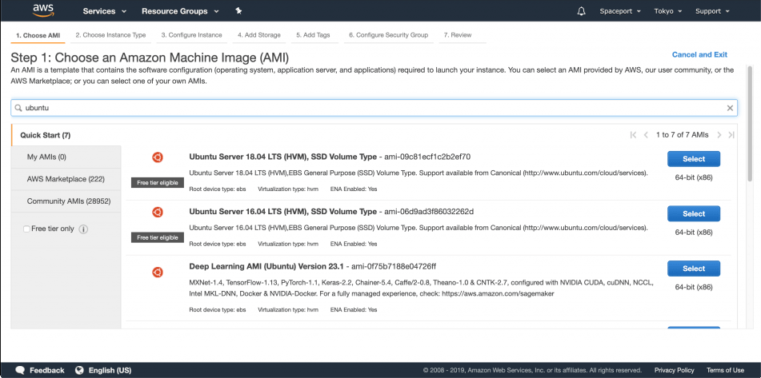

* Choose Instance Type like m4.xlarge or m5.xlarge series. There are two points here.
  * First one is you may optionally choose a bigger instance according to your streaming load.
  * Second one don’t use any m5a instances because they have ARM architecture.

Then click “Review and Launch”.

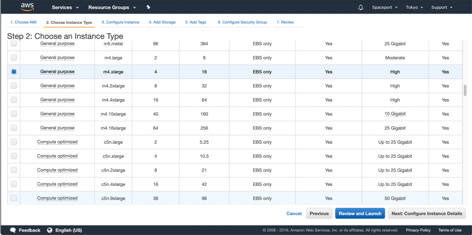

* Click “Edit Security Groups” in the image.

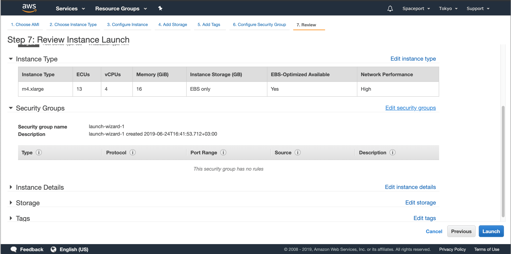

* Add “22” and “27017” TCP ports as follows in the image. Warning is critical for security. We’ll restrict source into a VPC later. Just click “Review and Launch” .

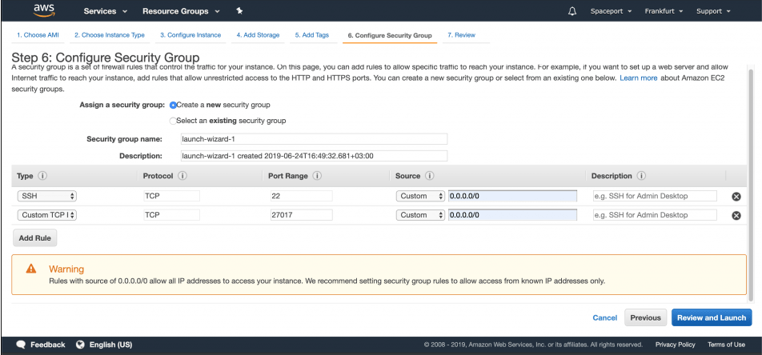

* In the coming window, Click “Launch” button again. Then it will ask to specify key file. Choose “Create new key pair” and click “Download Key Pair” button. After key file is downloaded. Click “Launch Instances”

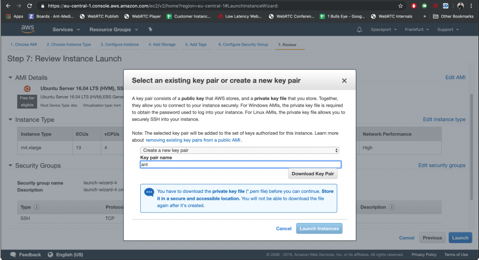

* Right now, your instances should be launching as shown in the image

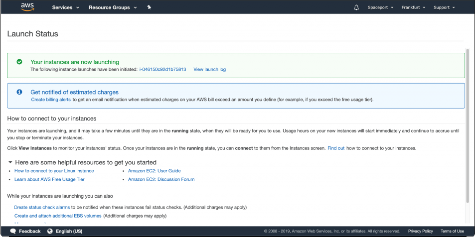

* Go to EC2 Instances and Click “Connect” button.

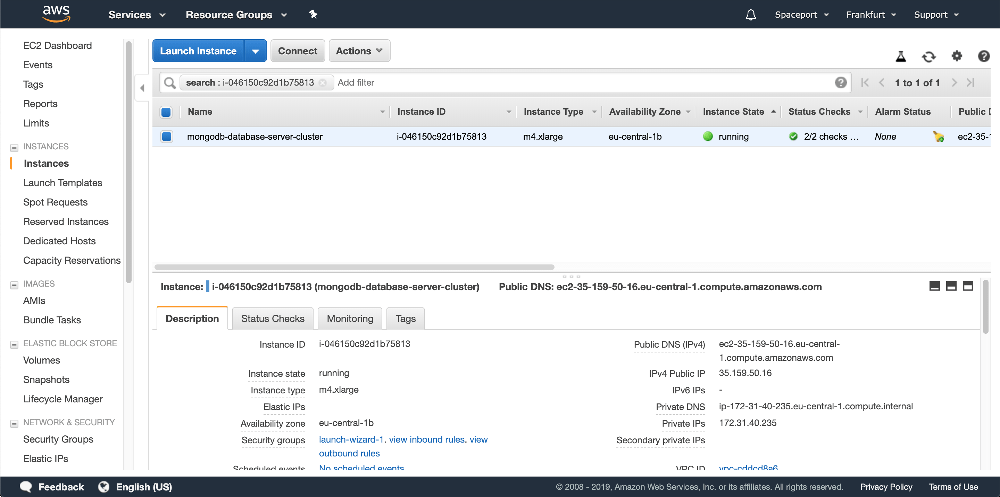

* It shows a dialog as follow and connect to instance via ssh

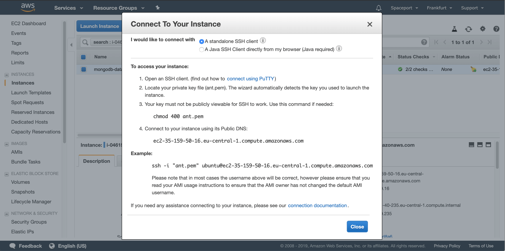

* Right now, you should connect to your instance. To Connect your instance, open a terminal and run a command something like. Please change {YOUR_KEY_FILE} and {INSTANCE_PUBLIC_IP} with your own credentials. For our case, they are “ant.pem” and “ec2-35-159-50-16.eu-central-1.compute.amazonaws.com”

> ssh -i {YOUR_KEY_FILE} ubuntu@{INSTANCE_PUBLIC_IP}

## Install MongoDB to Your Instance

* After you get connected, run the following commands in order to install MongoDB to your instance
```
wget -qO - https://www.mongodb.org/static/pgp/server-4.2.asc | sudo apt-key add -
echo "deb [ arch=amd64 ] https://repo.mongodb.org/apt/ubuntu `lsb_release -cs`/mongodb-org/4.2 multiverse" | sudo tee /etc/apt/sources.list.d/mongodb-org-4.2.list
sudo apt-get update
sudo apt-get install -y mongodb-org
```
* Open /etc/mongod.conf file with an editor like nano and change bind_ip value to 0.0.0.0  to let MongoDB accept connections in all interfaces and save it.

`sudo nano /etc/mongod.conf`

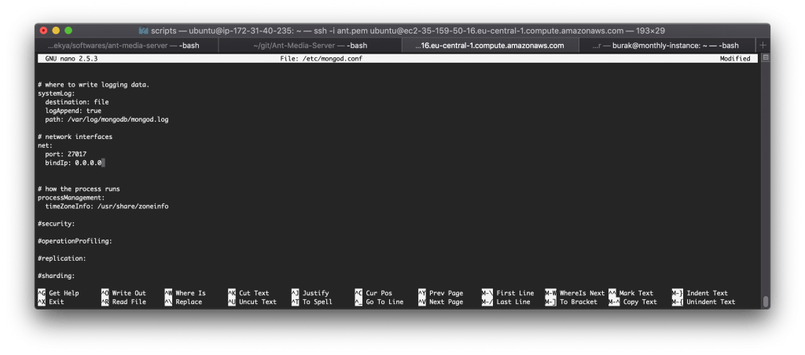

Press “Ctrl + X” to save the file.

Restart mongod and enable service.
```
sudo systemctl restart mongod
sudo systemctl enable mongod.service
```
MongoDB installation is complete, just save your MongoDB instance’s local address somewhere. We will use it in later.

## Step 2: Install Scalable Origin Group

* Click “Auto Scaling > Launch Configurations” and Click “Create Launch Configurations”

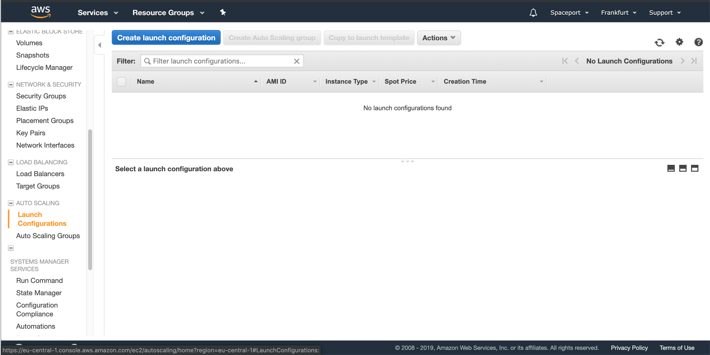

* Click “AWS Marketplace” on the left side menu. Search for “Ant Media Server” and Choose the “Ant Media Server Enterprise” and Click “Select”

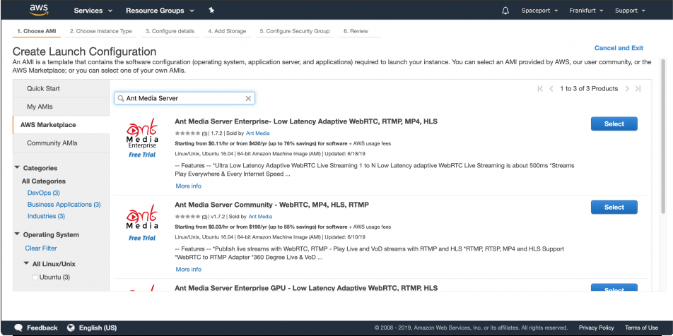

* Choose instance type, in our sample we choose m5.2xlarge. You can choose any instance type according to your project. After that click “Next: Configure details”

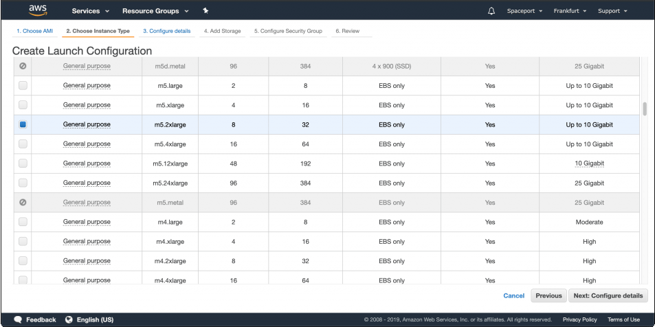

* In the coming window as shown in the image below,  We need to give name and set User data.

   * You can see the name field just under the Create Launch Configuration header. Give a name something like  “OriginGroup”
   * Then Click “Advanced Details” title. You will see the “User data” text area. Right now, copy the text below, change the “{MongoIP}” field with the MongoDB IP Address in the script and paste it to the “User data”.
   * After that Click “Skip to review”
```
#!/bin/bash
cd /usr/local/antmedia
./change_server_mode.sh cluster {MongoIP}
```
The form should be something like below

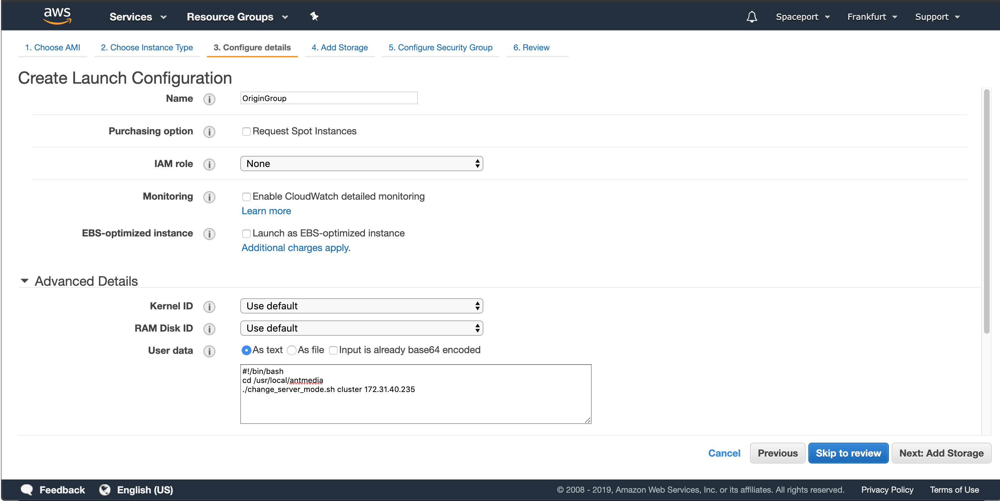

* Click “Create Launch Configuration”

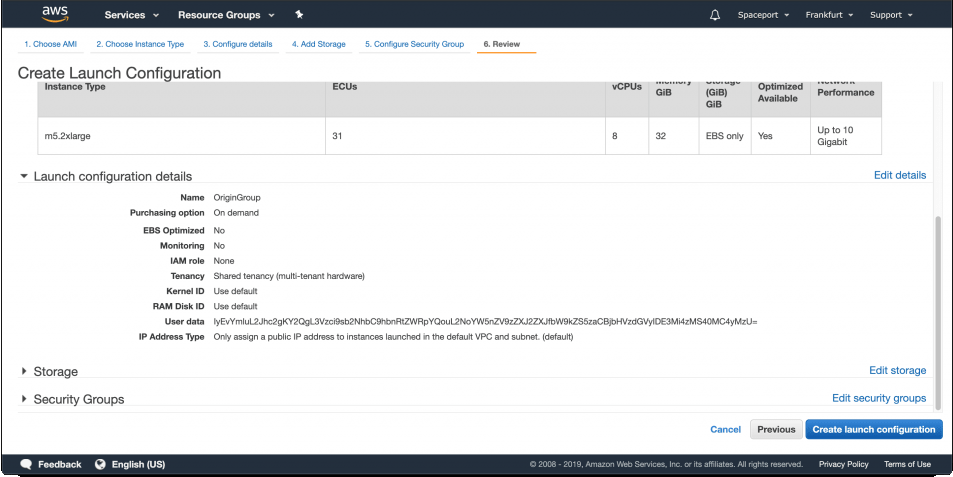

* After launch configuration is created successfully, Click the “Create an Auto Scaling Group using this Launch Configuration”

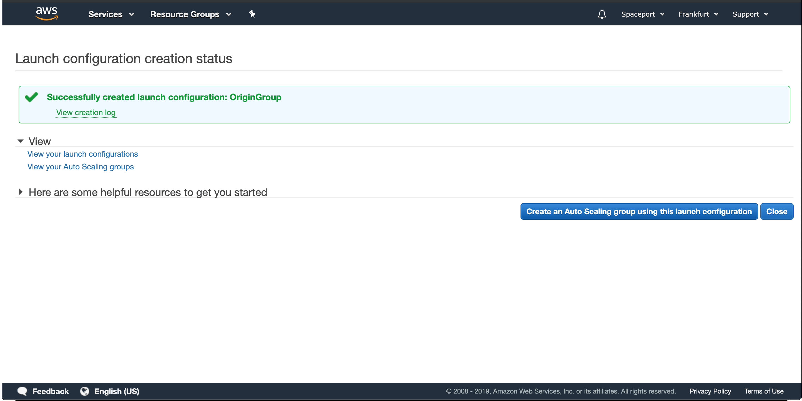

* Give a name to scaling group. We give “AMS-Origin-Group”  as a name and choose “eu-central-1a” subnet. We choose only one instance to let all instances appear in the same subnet for having better connectivity.  And then click “Configure Scaling Policies”

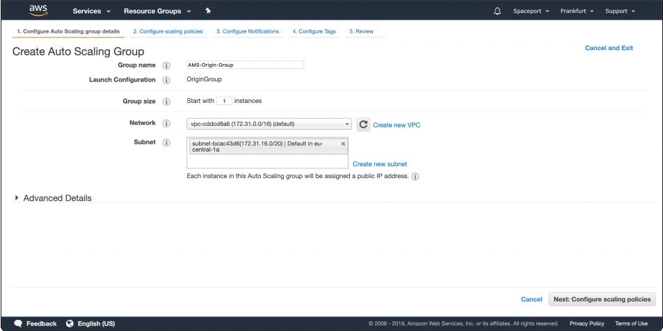

* Choose your scaling policy. In our sample below, our origin group will scale up to 10 instances by providing Average CPU Utilization with %60. Then Click Next and Next.

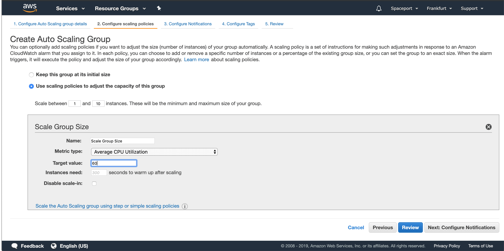

* Lastly, Review screen will come and click the “Create Auto Scaling group”

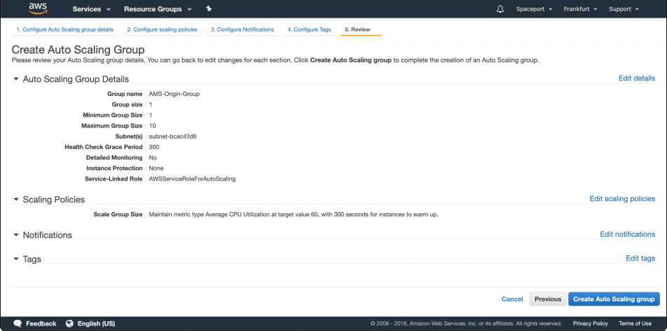

## Step 3: Install Scalable Edge Group

Installing scalable edge group almost same as scalable origin group.  Please go to Step 2: Install Scalable Origin Group and do the same things one more time. Just don’t forget to change some namings(for instance give group name as Edge Group) and configure scaling policy and instance type according to your needs. If you have any question or problem with this, please let us know through contact@antmedia.io

## Step 4: Install Load Balancer

* Click the “Load Balancings > Load Balancers”  on EC2 Service and Click the “Create” button under Application Load Balancer

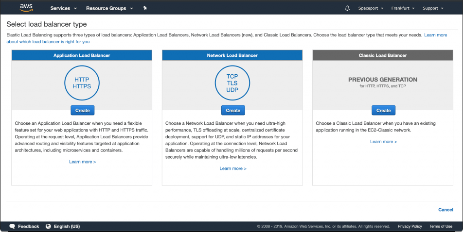

* Give a name to your Load Balancer. Choose both HTTP and HTTPS by clicking “Add listener”. The port settings should be like in the image below.
Lastly, choose eu-central-1a and eu-central-1b for availability zones. Then Click “Next: Configure Security Groups”

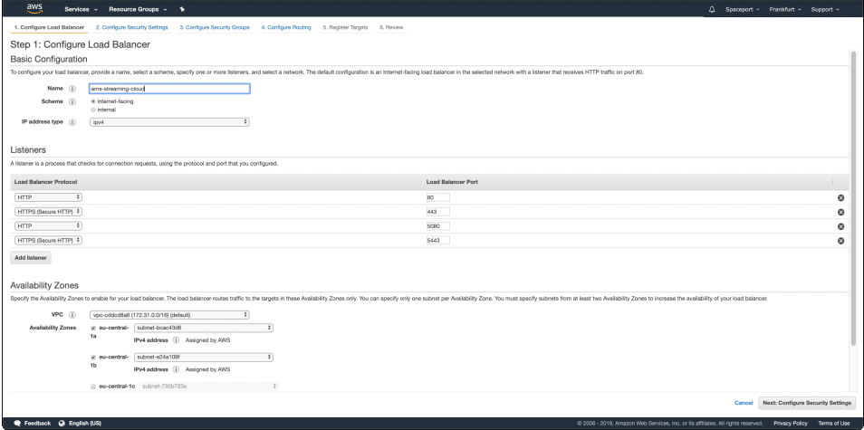

* Choose your domain certificate from the screen. Then click “Next: Configure Security Groups” . (If you don’t know how to create certificate for ACM, [please follow this guide](https://antmedia.io/ssl-from-aws-certificate-manager-for-domain-name/). )

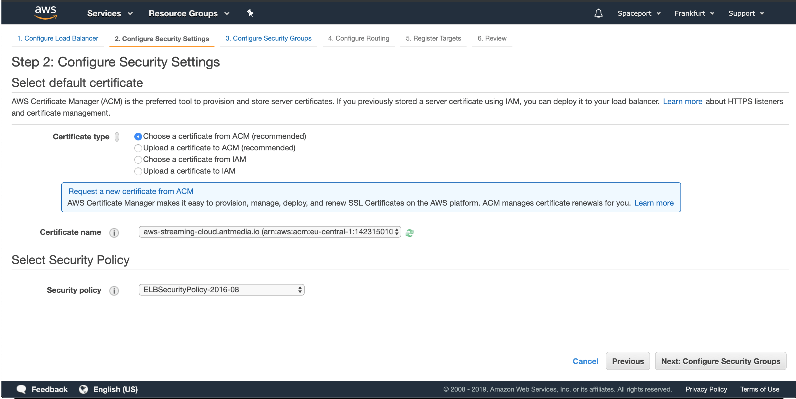

* Create Security Group as shown in the image and then Click Next

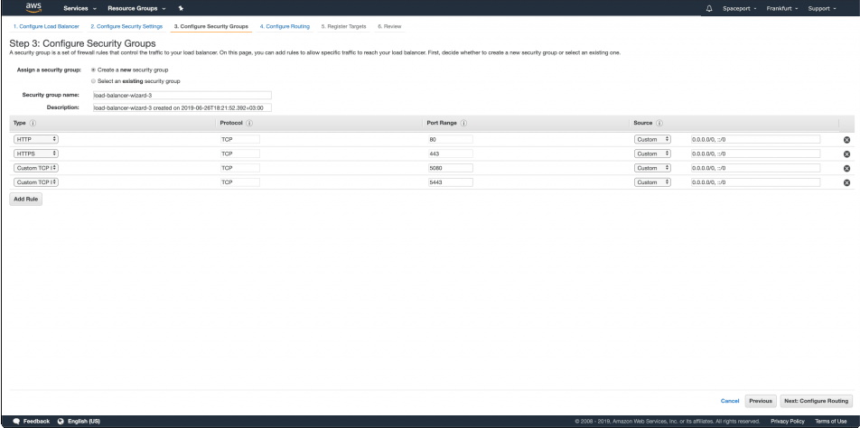

* Specify Routing as follows. Create a new target group and forward with HTTP through 5080 port

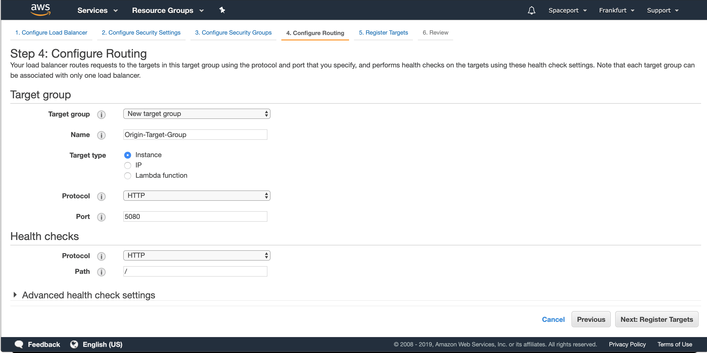

* In the Register Targets group, do nothing, just proceed because we bind target later. Proceed to Review section and Click the Create button

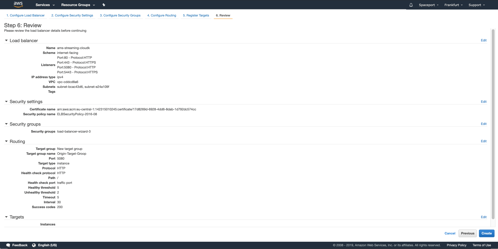

* Right now. All groups should be created, we just need to bind load balancer to the origin and edge scaling groups. Firstly, Go to the “Auto Scaling Groups” and Select the AMS Origin Group and Choose Edit in Actions drop down menu. Then choose the Origin-Target-Group in Target Group as follows in the image. Click “Save” button.

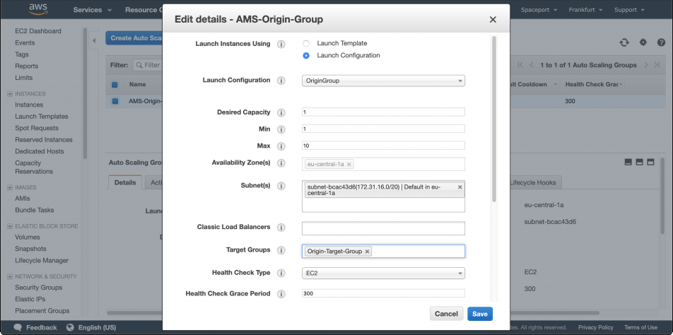

* The setting above lets Origin Group be in “Origin-Target-Group” so that Load Balancer can forward requests to the Origin Group. Right now it’s time for Edge Group.   We assume that you already created AMS-Edge-Group in Step 3. So that right now just Create a Target from “Load Balancing > Target Groups” as follows

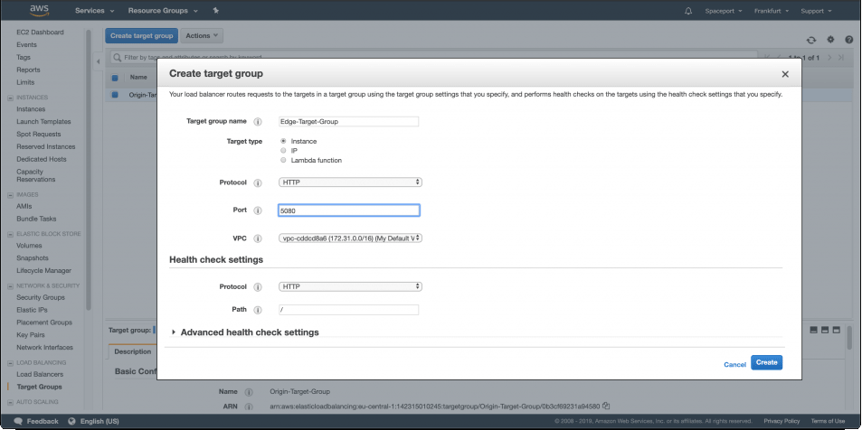

* Then Go to AMS-Edge-Group in “Auto Scaling > Auto Scaling Groups” and Click the Edit item in the Actions button and add Edge-Target-Group as Target Group as in the image below

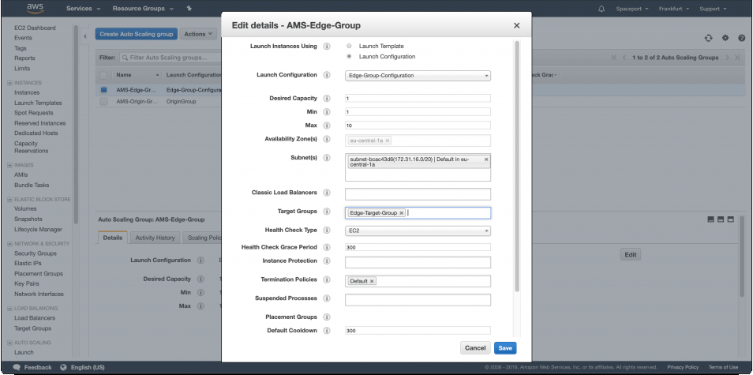

* Here is the last items for Load Balancer.  Go to Load Balancer. Add new Listener for 5080 and 5443 that forward requests to Edge-Target-Group. Firstly Click “Add Listener”

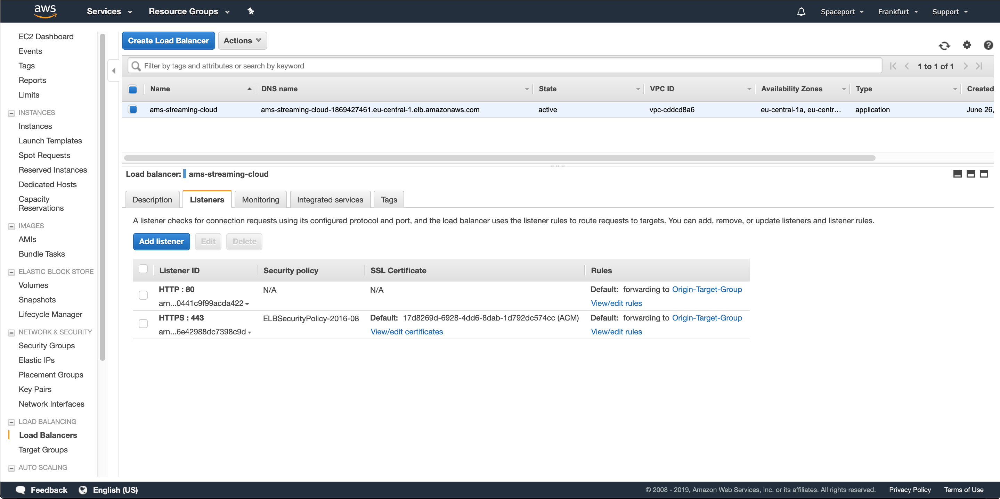

* Add Listener for HTTP(5080) and HTTPS(5443) as follows.

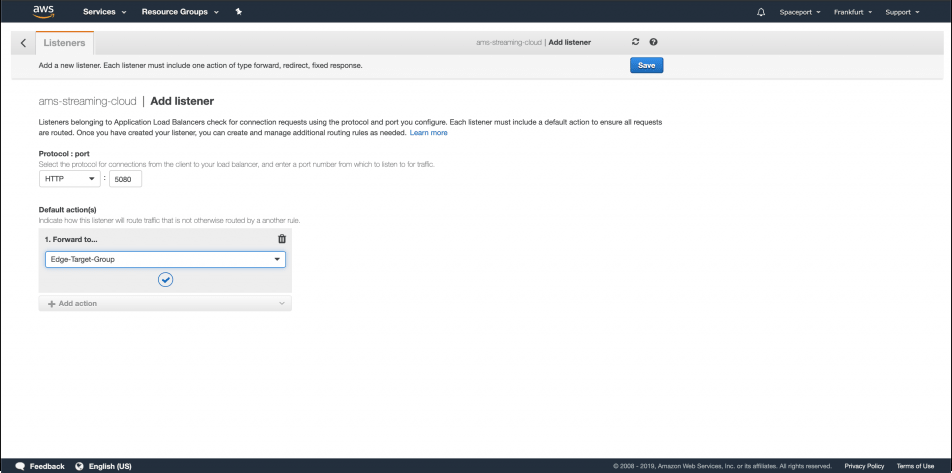

* Click “Save” button. It returns the Load Balancer screen then Click “Add Listener” again and add HTTPS(5443) as in the image below

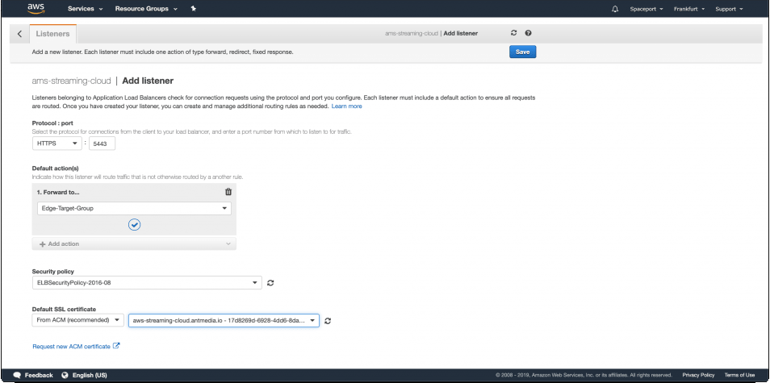

* Click “Save” button again.

Right now Everything is ok. Just let me give a brief information about the difference between publish and play. In our load balancer configuration, we forward HTTP(80) and HTTPS(443) to Origin Group and we forward HTTP(5080) and HTTPS(5443) to Edge Group. It means that we should connect 80 or 443 ports to publish and connect 5080 or 5443 to play streams. Otherwise, play requests goes to origin group and publish request goes to edge group and it’s likely create some performance issues according to your configurations.

## Logging in Web Panel

You can login to web panel via the https://your-domain-name/ and login with “JamesBond” and the first instances  instance-id in your origin group. If you don’t know the instance-id, please ssh to your mongodb instance and write the below commands via terminal

```
$ mongo
> use serverdb
> db.User.find()
```

It gives you an output like this

`{ "_id" : ObjectId("5d31612a4c79142df7c71914"), "className" : "io.antmedia.rest.model.User", "email" : "JamesBond", "password" : "i-1234567890abcdef0", "userType" : "ADMIN" }`

Your password is the one in “password” field in the format “i-xxxxxxxx”

## Test Fly

For publishing please visit the `https://your-domain-name/WebRTCAppEE/` and click “Start Publishing” button. The default stream id is “stream1”
For playing please visit the `https://your-domain-name:5443/WebRTCAppEE/` and click “Start Playing” button. The default stream will be played

As you figure out, we connect default https port(443) for publishing and 5443 port for playing. Because we configure load balancer to forward default port(443) to origin group and 5443 to edge group.


