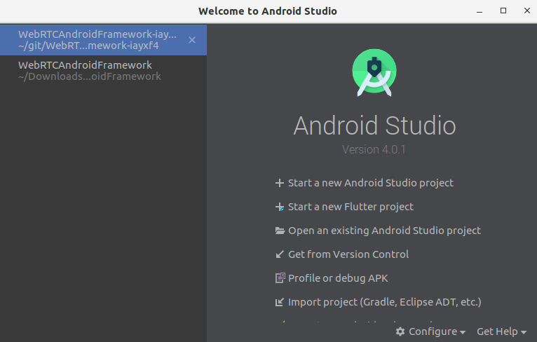
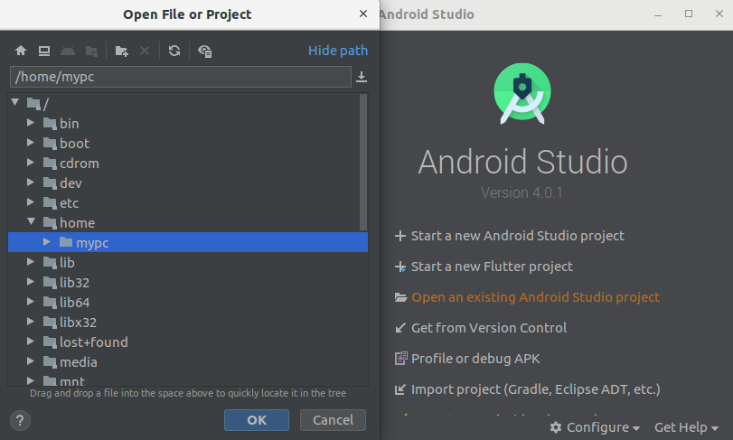

Ant Media's WebRTC Android SDK lets you build your own Android application that can publish and play WebRTC broadcasts with just a few lines of code.   
In this doc, we're going to cover the following topics. 
* [Run the Sample WebRTC Android app](#run-the-sample-webrtc-android-app)
  * [Publish Stream from your Android](#publish-stream-from-your-android)
  * [Play Stream on your Android](#play-stream-from-your-android)
  * [P2P Communication with your Android](#p2p-communication-with-your-android)
  * [Join Conference Room with your Android](#join-conference-room-with-your-android)
* [Develop a WebRTC Android app](#develop-a-webrtc-android-app)
  * [How to Publish](#how-to-publish)
  * [How to Play](#how-to-play)
  * [How to use Data Channel](#how-to-use-data-channel)
  * [How to use Conference Room](#how-to-use-data-channel)

# Run the Sample WebRTC Android app

* ### Download the WebRTC Android SDK
  WebRTC iOS and Android SDK's are free to download. You can access them through [this link on antmedia.io](https://antmedia.io/free-webrtc-android-ios-sdk/). If you're an enterprise user, it will be also available for you to download in your subscription page. Anyway, after you download the SDK, you can just unzip the file and open the project with Android. 

* ### Open and Run the Project in Android

  Just Click Open an Existing Android Studio Project. A window should open as shown below for the project path.



Select your project in a path and Click to the OK button.



> PS: You need to set `SERVER_ADDRESS` parameter in MainActivity.java

## Publish Stream from your Android

  * You need to set `webRTCMode` parameter in `IWebRTCClient.MODE-PUBLISH`

  * Set the stream id to anything else then `stream1` and Tap `Start Publishing` button on the main screen. After the click `Start Publishing`, stream will be published on Ant Media Server.

    

  * Then it will start Publishing to your Ant Media Server. You can go to the web panel of Ant Media Server(http://server_ip:5080) and watch the stream there. You can also quickly play the stream via `https://your_domain:5443/WebRTCAppEE/player.html`

## Play Stream from your Android

  * Firtsly, you need to set `webRTCMode` parameter in `IWebRTCClient.MODE_PLAY`.

  * Playing stream on your Android is almost the same as Publishing. Before playing, make sure that there is a stream is already publishing to the server with same stream id in your `streamId` parameter (You can quickly publish to the Ant Media Server via `https://your_domain:5443/WebRTCAppEE`). For our sample, stream id is still "stream1" in the image below. Then you just need to tap `Start Playing` button.

    

## P2P Communication with your Android

  WebRTC Android SDK also supports P2P communication. As you guess, just set `webRTCMode` parameter to `IWebRTCClient.MODE_JOIN`.

  

  When there is another peer is connected to the same stream id via Android, iOS or Web, then P2P communication will be established and you can talk to each other. You can quickly connect to the same stream id via `https://your_domain:5443/WebRTCAppEE/peer.html`

## Join Conference Room with your Android

  WebRTC Android SDK also supports Conference Room feature. You just need to start ConferenceActivity.java activity.

  

  When there are other streams are connected to the same stream id via Android, iOS or Web, then Conference Room will be established and you can talk to each other. You can quickly connect to the same stream id via `https://your_domain:5443/WebRTCAppEE/conference.html`

# Develop a WebRTC Android app

We highly recommend using the sample project to get started your application. Nevertheless, it's good to know the dependencies and how it works. So that we're going to tell how to create a WebRTC Android app from Scratch. Let's get started. 

## Creating Android Project
 
### Open Android Studio and Create a New Android Project
Just Click **`File > New > New Project`** . A window should open as shown below for the project details. Fill the form according to your Organization and Project Name


Click Next button and Choose **`Phone and Tablet`** as below. 


Lastly Choose **`Empty Activity`** in the next window


Let the default settings for activity name and layout. Click Next and finish creating the project.

### Import WebRTC SDK as Module to Android Project 

After creating the project. Let's import the WebRTC Android SDK to the project. For doing that click
**`File > New > Import Module`** . Choose the directory of the WebRTC Android SDK and click the Finish button.


If module is not included in the project, add the module name into `settings.gradle` file as shown in the image below.


### Add dependency to Android Project App Module

Right-click `app`, choose `Open Module Settings`and click the `Dependencies` tab. Then a window should appear as below. Click the `+` button at the bottom and choose `Module Dependency``


Choose WebRTC Native Android SDK and click OK button


#### **CRITICAL thing about that** You need import Module as an **API** as shown in the image below. You can change it from **Implementation** to **API** in the drop-down list


## Prepare the App for Streaming

  * Create a MainActivity.java Class and add a Button to your activity main layout. This is just simple Android App development, we don't give details here. You can get lots of tutorials about that on the Internet.

  * Add permissions in Manifest file.

Open the AndroidManifest.xml and add below permissions between `application` and `manifest`tag
```xml
    <uses-feature android:name="android.hardware.camera" />
    <uses-feature android:name="android.hardware.camera.autofocus" />
    <uses-feature
        android:glEsVersion="0x00020000"
        android:required="true" />

    <uses-permission android:name="android.permission.CAMERA" />
    <uses-permission android:name="android.permission.CHANGE_NETWORK_STATE" />
    <uses-permission android:name="android.permission.MODIFY_AUDIO_SETTINGS" />
    <uses-permission android:name="android.permission.RECORD_AUDIO" />
    <uses-permission android:name="android.permission.BLUETOOTH" />
    <uses-permission android:name="android.permission.INTERNET" />
    <uses-permission android:name="android.permission.WRITE_EXTERNAL_STORAGE" />
    <uses-permission android:name="android.permission.ACCESS_NETWORK_STATE" />
    <uses-permission android:name="android.permission.READ_PHONE_STATE" />
    <uses-permission android:name="android.permission.READ_EXTERNAL_STORAGE" />
```


### Implement MainActivity onCreate function

Open the MainActivity.java and implement it as below. You should change `SERVER_URL` according to your Ant Media Server address. Secondly, the third parameter in the last line of the code below is `IWebRTCClient.MODE_PUBLISH` that publishes the stream to the server. You can use `IWebRTCClient.MODE_PLAY` for playing stream and `IWebRTCClient.MODE_JOIN` for P2P communication. If token control is enabled, you should define `tokenId` parameter.

```java
   /**
     * Change this address with your Ant Media Server address
     */
    public static final String SERVER_ADDRESS = "serverdomain.com:5080";

    /**
     * Mode can Publish, Play or P2P
     */
    private String webRTCMode = IWebRTCClient.MODE_PLAY;

    public static final String SERVER_URL = "ws://"+ SERVER_ADDRESS +"/WebRTCAppEE/websocket";
    public static final String REST_URL = "http://"+SERVER_ADDRESS+"/WebRTCAppEE/rest/v2";
    private CallFragment callFragment;

    private WebRTCClient webRTCClient;

    private Button startStreamingButton;
    private String operationName = "";
    private Timer timer;
    private String streamId;

    @RequiresApi(api = Build.VERSION_CODES.M)
    @Override
    protected void onCreate(Bundle savedInstanceState) {
        super.onCreate(savedInstanceState);

        // Set window styles for fullscreen-window size. Needs to be done before
        // adding content.
        requestWindowFeature(Window.FEATURE_NO_TITLE);
        getWindow().addFlags(WindowManager.LayoutParams.FLAG_FULLSCREEN | WindowManager.LayoutParams.FLAG_KEEP_SCREEN_ON
                | WindowManager.LayoutParams.FLAG_DISMISS_KEYGUARD | WindowManager.LayoutParams.FLAG_SHOW_WHEN_LOCKED
                | WindowManager.LayoutParams.FLAG_TURN_SCREEN_ON);
        //getWindow().getDecorView().setSystemUiVisibility(getSystemUiVisibility());

        setContentView(R.layout.activity_main);
        SurfaceViewRenderer cameraViewRenderer = findViewById(R.id.camera_view_renderer);
        SurfaceViewRenderer pipViewRenderer = findViewById(R.id.pip_view_renderer);

        startStreamingButton = (Button)findViewById(R.id.start_streaming_button);

        // Check for mandatory permissions.
        for (String permission : CallActivity.MANDATORY_PERMISSIONS) {
            if (this.checkCallingOrSelfPermission(permission) != PackageManager.PERMISSION_GRANTED) {
                Toast.makeText(this, "Permission " + permission + " is not granted", Toast.LENGTH_SHORT).show();
                return;
            }
        }

        if (webRTCMode.equals(IWebRTCClient.MODE_PUBLISH)) {
            startStreamingButton.setText("Start Publishing");
            operationName = "Publishing";
        }
        else  if (webRTCMode.equals(IWebRTCClient.MODE_PLAY)) {
            startStreamingButton.setText("Start Playing");
            operationName = "Playing";
        }
        else if (webRTCMode.equals(IWebRTCClient.MODE_JOIN)) {
            startStreamingButton.setText("Start P2P");
            operationName = "P2P";
        }

        this.getIntent().putExtra(EXTRA_CAPTURETOTEXTURE_ENABLED, true);
        this.getIntent().putExtra(EXTRA_VIDEO_FPS, 30);
        this.getIntent().putExtra(EXTRA_VIDEO_BITRATE, 2500);
        this.getIntent().putExtra(EXTRA_CAPTURETOTEXTURE_ENABLED, true);

        webRTCClient = new WebRTCClient( this,this);

        //webRTCClient.setOpenFrontCamera(false);

        streamId = "stream1";
        String tokenId = "tokenId";

        webRTCClient.setVideoRenderers(pipViewRenderer, cameraViewRenderer);

       // this.getIntent().putExtra(CallActivity.EXTRA_VIDEO_FPS, 24);
        webRTCClient.init(SERVER_URL, streamId, webRTCMode, tokenId, this.getIntent());
    }

    public void startStreaming(View v) {
        if (!webRTCClient.isStreaming()) {
            ((Button)v).setText("Stop " + operationName);
            webRTCClient.startStream();
        }
        else {
            ((Button)v).setText("Start " + operationName);
            webRTCClient.stopStream();
        }
    }
```

### Create activity_main.xml layout

Create an activity_main.xml layout file and add below codes.

```xml
    <?xml version="1.0" encoding="utf-8"?>
    <FrameLayout xmlns:android="http://schemas.android.com/apk/res/android"
        xmlns:app="http://schemas.android.com/apk/res-auto"
        xmlns:tools="http://schemas.android.com/tools"
        android:layout_width="match_parent"
        android:layout_height="match_parent"
        tools:context=".MainActivity">

    <org.webrtc.SurfaceViewRenderer
        android:id="@+id/camera_view_renderer"
        android:layout_width="match_parent"
        android:layout_height="wrap_content"
        android:layout_gravity="center" />

    <org.webrtc.SurfaceViewRenderer
        android:id="@+id/pip_view_renderer"
        android:layout_height="144dp"
        android:layout_width="wrap_content"
        android:layout_gravity="bottom|end"
        android:layout_margin="16dp"/>

    <Button
        android:layout_width="wrap_content"
        android:layout_height="wrap_content"
        android:text="Start"
        android:id="@+id/start_streaming_button"
        android:onClick="startStreaming"
        android:layout_gravity="bottom|center"/>

    <FrameLayout
        android:id="@+id/call_fragment_container"
        android:layout_width="match_parent"
        android:layout_height="match_parent" />

    </FrameLayout>
```

## How to Publish

We need to change some codes in onCreate. As a result, following code snippets just publish the stream on your server with `streamId`: 'stream1'.

  * You need to set `webRTCMode` to`IWebRTCClient.MODE_PUBLISH`.

```java
    private String webRTCMode = IWebRTCClient.MODE_PUBLISH;
```

  * It's now to write some code. Initialize `webRTCClient` in `MainActivity.java`.

```java
    private WebRTCClient webRTCClient;

    webRTCClient.setVideoRenderers(pipViewRenderer, cameraViewRenderer);
    webRTCClient.init(SERVER_URL, streamId, webRTCMode, tokenId, this.getIntent());`
```

## How to Play

Playing a Stream is almost the same with Publishing. We just need to change some codes in onCreate. As a result, following code snippets just plays the stream on your server with `streamId`: 'stream1'. Make sure that, before you try to play, you need to publish a stream to your server with having stream id 'stream1'

  * You need to set `webRTCMode` to`IWebRTCClient.MODE_PLAY`.

```java
    private String webRTCMode = IWebRTCClient.MODE_PLAY;
```

  * It's now to write some code. Initialize `webRTCClient` in `MainActivity.java`.

```java
    private WebRTCClient webRTCClient;

    webRTCClient.setVideoRenderers(pipViewRenderer, cameraViewRenderer);
    webRTCClient.init(SERVER_URL, streamId, webRTCMode, tokenId, this.getIntent());`
```

## How to use Data Channel

Ant Media Server and Android SDK can use data channels in WebRTC. In order to use Data Channel, make sure that it's enabled both [server-side](https://github.com/ant-media/Ant-Media-Server/wiki/Data-Channel) and mobile.

Before initialization of webRTCClient you need to:

* Set your Data Channel observer in the WebRTCClient object like this:

```java
    webRTCClient.setDataChannelObserver(this);
```

* Enable data channel communication by putting following key-value pair to your Intent before initialization of WebRTCClient with it:

```java
    this.getIntent().putExtra(EXTRA_DATA_CHANNEL_ENABLED, true);
```

  Then your Activity is ready to send and receive data.

* To send data, call `sendMessageViaDataChannel` method of WebRTCClient and pass the raw data like this:

```java
    webRTCClient.sendMessageViaDataChannel(buf);
```

## How to use Conference Room

Ant Media Server also supports ConferenceRoom feature. You need to initialize `ConferenceManager`.

```java
    private ConferenceManager conferenceManager;

    conferenceManager = new ConferenceManager(
                this,
                this,
                getIntent(),
                MainActivity.SERVER_URL,
                roomId,
                publishViewRenderer,
                playViewRenderers,
                streamId,
                this
     );
```

> Check also -> https://github.com/ant-media/Ant-Media-Server/wiki/WebRTC-Conference-Call