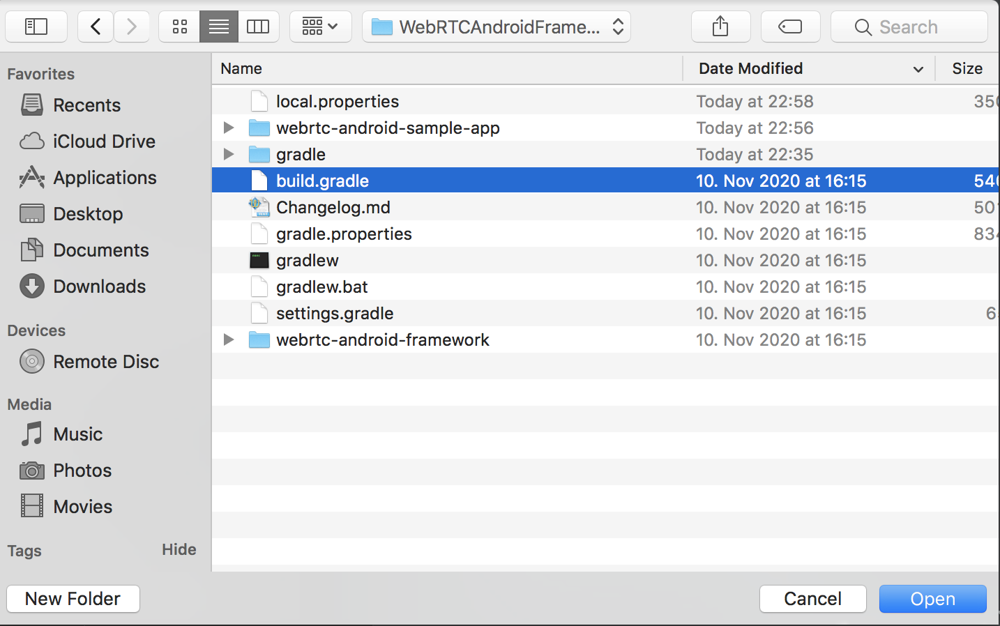

Ant Media's WebRTC Android SDK lets you build your own Android application that can publish and play WebRTC broadcasts with just a few lines of code.   
In this doc, we're going to cover the following topics. 
* Run the Sample WebRTC Android app
  * Publish Stream from your Android
  * Play Stream on your Android
  * P2P Communication with your Android
* Develop a WebRTC Android app
  * How to Publish
  * How to Play
  * How to use DataChannel

# Run the Sample WebRTC Android app

* ### Download the WebRTC Android SDK
  WebRTC iOS and Android SDK's are free to download. You can access them through [this link on antmedia.io](https://antmedia.io/free-webrtc-android-ios-sdk/). If you're an enterprise user, it will be also available for you to download in your subscription page. Anyway, after you download the SDK, you can just unzip the file and open the project with Android. 

* ### Open and Run the Project in Android

Just Click Open an Existing Android Studio Project. A window should open as shown below for the project path.

Select your project in a path and Click to the OK button.

* ### Publish Stream from your Android

  * You need to set your AMS server address in MainActivity

