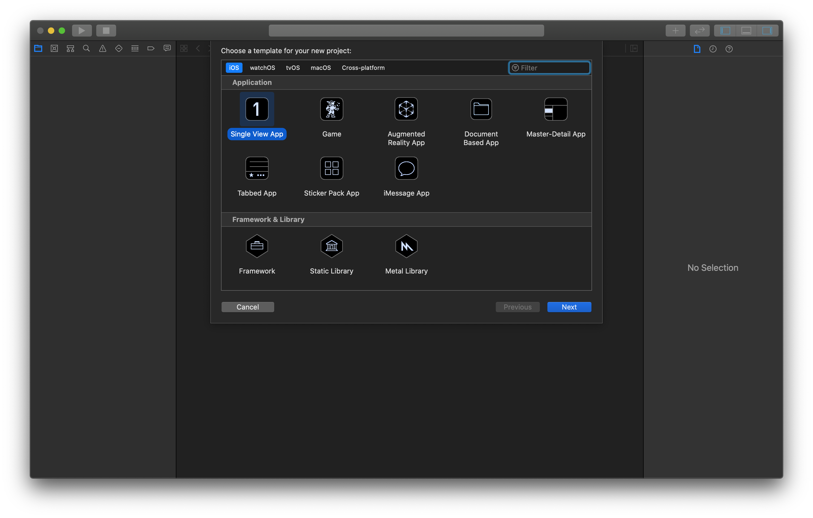
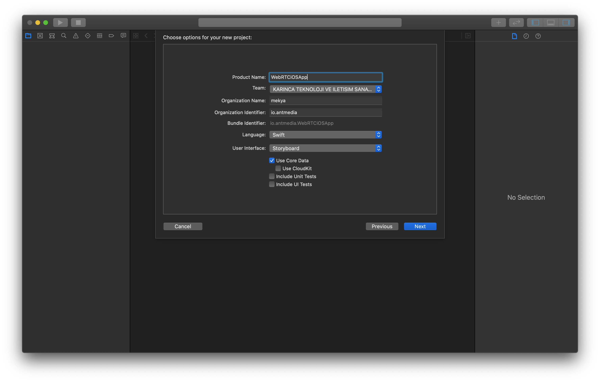
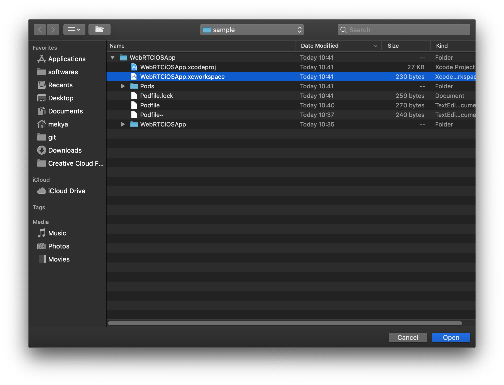
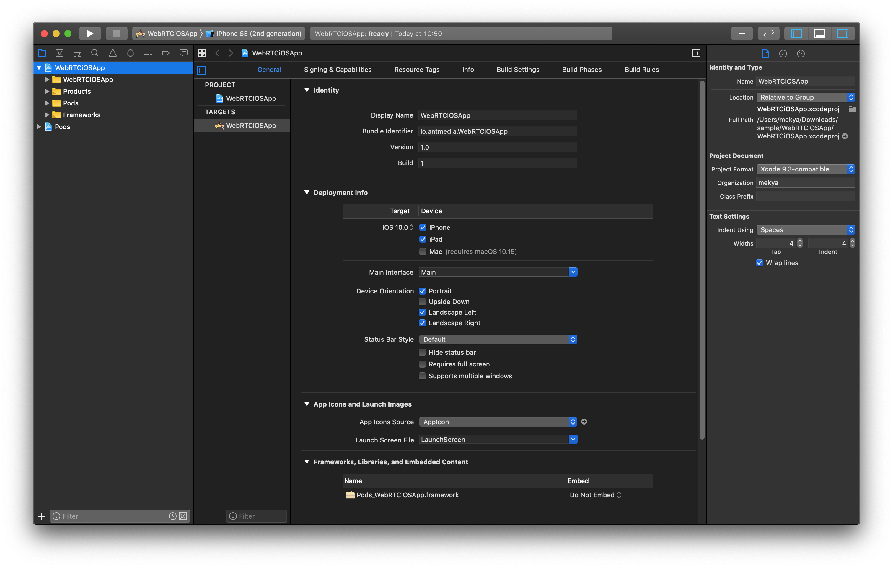
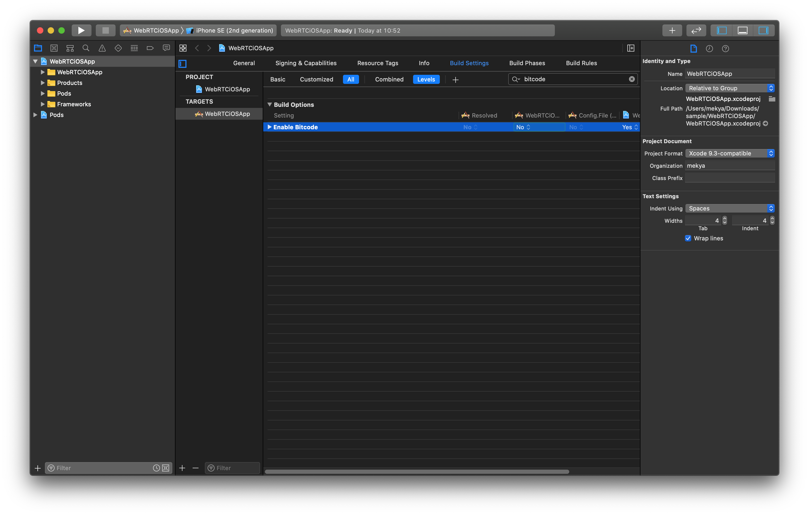
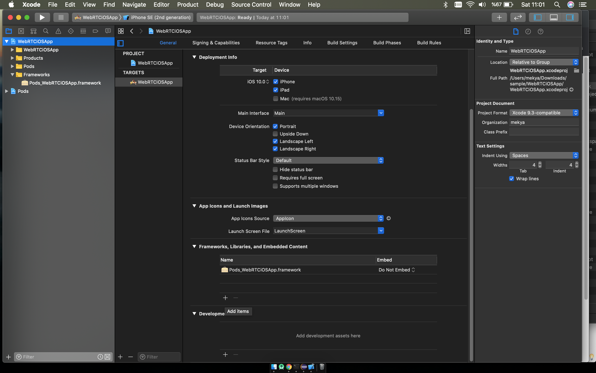
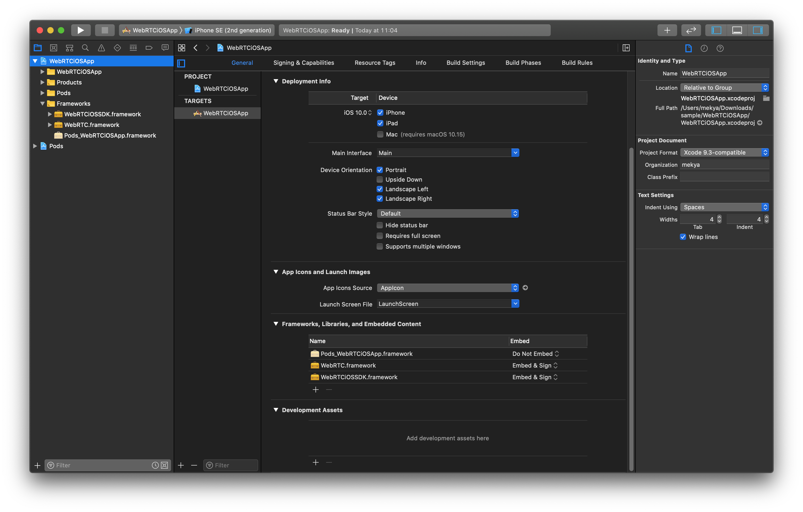
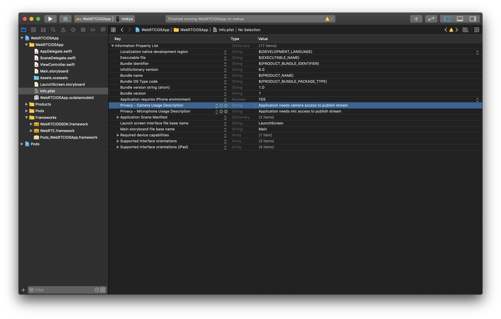

Ant Media's WebRTC iOS SDK lets you build your own iOS application that can publish and play WebRTC broadcasts with just a few lines of code.   
In this doc, we're going to cover the following topics. 
* How to Run the Sample WebRTC iOS app
  * Publish Stream from your iPhone
  * Play Stream on your iPhone
  * P2P Communication with your iPhone
* How to develop a WebRTC iOS app
  * How to Publish
  * How to Play
  * How to use DataChannel
* FAQ 

## How to Run the Sample WebRTC iOS app

* ### Download the WebRTC iOS SDK
  WebRTC iOS and Android SDK's are free to download. You can access them through [this link on antmedia.io](https://antmedia.io/free-webrtc-android-ios-sdk/). If you're an enterprise user, it will be also available for you to download in your subscription page. Anyway, after you download the SDK, you can just unzip the file and open the project with Xcode. 

* ### Install Dependency

  Open your terminal and go to the directory where the reference project resides and run `pod install` . If you are not familiar with pods, visit [cocoapods.org](https://cocoapods.org/) for documentation and installation. 

  ```
  cd /go/to/the/directory/where/you/unzip/the/SDK
  pod install
  ```
  This install the Starscream packet for WebSocket connections. 

* ### Open and Run the Project in Xcode

  Open the Xcode in your MacOS and Click the Open Another Project if you don't see the Sample Project in your list.

   

  Go to the directory where you download and unzip the iOS SDK. Open the `AntMediaReferenceApplication.xcworkspace` file

  

  After project opens, connect your iPhone to your Mac and choose your iPhone in Xcode as shown below. 

  

  Click `Run` button on the top left of the Xcode. Then project is going to be built and deployed to your iPhone. 

  

* ### Publish Stream from your iPhone 

  * Tap `Publish` button and then Tap `Set Server IP` under the connect button in your iPhone. 

    


  * Write Your Ant Media Server's full WebSocket URL and tap `Save` button. Its format is like this `ws://192.168.7.25:5080/WebRTCAppEE/websocket`. If you install SSL to Ant Media Server, you can also use `wss://your_domain_address:5443/WebRTCAppEE/websocket`.

    


  * Set the stream id to anything else then 'stream1' and Tap 'Connect' button on the main screen. Then it will ask you to access the Camera and Mic. After you allow the Camera and Mic access, stream will be published on Ant Media Server. 
 
    

  * Then it will start Publishing to your Ant Media Server. You can go to the web panel of Ant Media Server(http://server_ip:5080) and watch the stream there.You can also quickly play the stream via https://your_domain:5443/WebRTCAppEE/player.html

* ### Play Stream on your iPhone

  Playing stream on your iPhone is almost the same as Publishing. Before playing, make sure that there is a stream is already publishing to the server with same stream id in your textbox (You can quickly publish to the Ant Media Server via https://your_domain:5443/WebRTCAppEE). For our sample, stream id is still "stream1" in the image below. Then you just need to tap 'Play' button and tap 'Connect' button.  

  

  After tapping 'Connect' button, stream will start playing. 

* ### P2P Communication with your iPhone
  WebRTC iOS SDK also supports P2P communication. As you guess, just tap 'P2P' and then 'Connect' button. 

  

  When there is another peer is connected to the same stream id via Android, iOS or Web, then P2P communication will be established and you can talk each other. You can quick connect to the same stream id via https://your_domain:5443/WebRTCAppEE/peer.html


## How to develop a WebRTC iOS app from Scratch

We highly recommend using the sample project to get started your application. Nevertheless, it's good to know the dependencies and how it works. So that we're going to tell how to create a WebRTC iOS app from Scratch. Let's get started. 

### Create Xcode Project
* Open Xcode and Create a project. Choose `Single View App` from the templates. 



* Name your project as 'WebRTCiOSApp' below



* Open your terminal and go to the directory where you create your project and make the pod installation. You can learn more about pods on [cocoapods.org](https://cocoapods.org/)
  ```
  cd /go/to/the/directory/where/you/create/the/project
  pod init
  ```

  `Podfile` should be created after running `pod init`. Open the `Podfile`, paste the following and save it. 
   ```
   target 'WebRTCiOSApp' do
     # Comment the next line if you don't want to use dynamic frameworks
     use_frameworks!

     # Pods for WebRTCiOSApp
    pod 'Starscream', '~> 3.1.1'
   end
   ```
  
   Run the following command for pod installation
   ```
   pod install
   ```

   Close the Xcode project and open the `WebRTCiOSApp.xcworkspace` in Xcode
    
   


  * Make the Project Target to iOS 10 

  

  * Disable bitcode 

  

  * Copy `WebRTC.framework` and `WebRTCiOSSDK.framework` folders to your projects directory.
    * `WebRTC.Framework`: is directly available under `WebRTCiOSReferenceProject`
    * `WebRTCiOSSDK.Framework`: is created by running `./export_fat_framework.sh` in `WebRTCiOSReferenceProject` directory. After that, it will be ready under `Release-universal` directory. Alternatively, you can import source code of `WebRTCiOSSDK` to your project directly.
  
  * Embed `WebRTC.framework` and `WebRTCiOSSDK.framework` to your projects. 

  

  * Choose 'Add Others' in the coming windows at the bottom left and select `Add Files`. Then add `WebRTC.framework` and `WebRTCiOSSDK.framework`. After it's dones, it should be shown like below. 

   


  * Try to build and run the app. If you get some errors like some methods are only available in some iOS versions. Use `@available` annotation. You can get more info about this [on this post](https://fluffy.es/allow-app-created-in-xcode-11-to-run-on-ios-12-and-lower/)

### How to Publish

  * Create a UIView and add a Button to your StoryBoard. This is just simple iOS App development, we don't give details here. You can get lots of tutorial about that in the Internet.

  * Add Mic and Camera Usage Descriptions 

  


  * It's now to write some code. Initialize `webRTCClient` in `ViewController`

    ```swift
    let webRTCClient: AntMediaClient = AntMediaClient.init()
    ```
  * Add the following codes to `viewDidLoad()` method.
    ```swift
     webRTCClient.delegate = self
     webRTCClient.setOptions(url: "ws://ovh36.antmedia.io:5080/WebRTCAppEE/websocket", streamId: "stream123", token: "", mode: .publish, enableDataChannel: false)
     webRTCClient.setLocalView(container: videoView, mode: .scaleAspectFit)
     webRTCClient.start()
    ``` 
  * Implement the delegate in your `ViewController`. Xcode helps you for implementation.

  * ViewController should look below. After you run the Application, it will start publishing with streamId: 'stream123' to your server.
    ```swift
    class ViewController: UIViewController {
    
      @IBOutlet var videoView: UIView!
    
      let webRTCClient: AntMediaClient = AntMediaClient.init()
    
      override func viewDidLoad() {
        super.viewDidLoad()
        
        webRTCClient.delegate = self
        //Don't forget to write your server url.
        webRTCClient.setOptions(url: "ws://your_server_url:5080/WebRTCAppEE/websocket", streamId: "stream123", token: "", mode: .publish, enableDataChannel: false)
        webRTCClient.setLocalView(container: videoView, mode: .scaleAspectFit)
        webRTCClient.start()
      }

    }
    ```  
 
 
### How to Play

  Playing a Stream is simpler than Publishing. We just need to change some codes in `viewDidLoad()`. As a result, following code snippets just plays the stream on your server with streamId: 'stream123'. Make sure that, before you try to play, you need to publish a stream to your server with having stream id 'stream123'

 ```swift
   class ViewController: UIViewController {
    
     @IBOutlet var videoView: UIView!
    
     let webRTCClient: AntMediaClient = AntMediaClient.init()
    
     override func viewDidLoad() {
        super.viewDidLoad()
        
       
        webRTCClient.delegate = self
         //Don't forget to write your server url.
        webRTCClient.setOptions(url: "ws://your_server_url:5080/WebRTCAppEE/websocket", streamId: "stream123", token: "", mode: .play, enableDataChannel: false)
        webRTCClient.setRemoteView(remoteContainer: videoView, mode: .scaleAspectFit)
        webRTCClient.start()
    }
  }
  ``` 

### How to use Data Channel

  Ant Media Server and iOS SDK can use data channels in WebRTC.  In order to use Data Channel, make sure that it's enabled both [server side](https://github.com/ant-media/Ant-Media-Server/wiki/Data-Channel) and mobile.  In order to enable it for server side, you can just set the `enableDataChannel` parameter to true in `setOptions` method. 

   ```swift
   webRTCClient.setOptions(url: "ws://your_server_url:5080/WebRTCAppEE/websocket", streamId: "stream123", 
       token: "", mode: .play, enableDataChannel: true)
   ```

   After that, you can send data with the following method of `AntMediaClient`
   ```swift
   func sendData(data: Data, binary: Bool = false)
   ```

   When a new message is received, the delegate's following method is called.

   ```
   func dataReceivedFromDataChannel(streamId: String, data: Data, binary: Bool)
   ```

   There is also data channel usage example exist in the Reference project.

  


