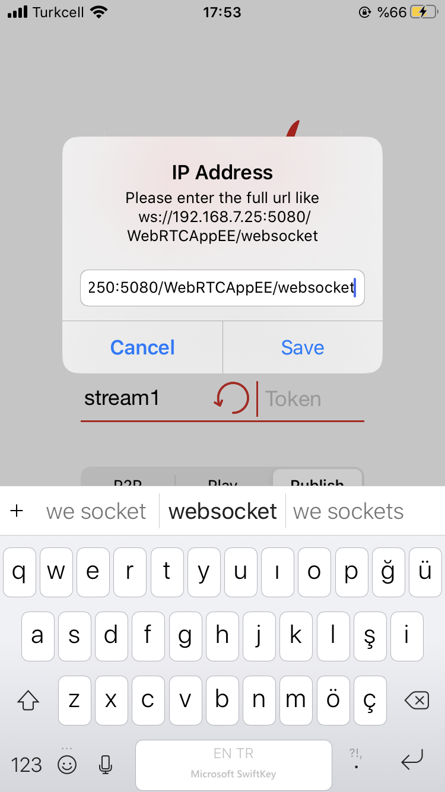
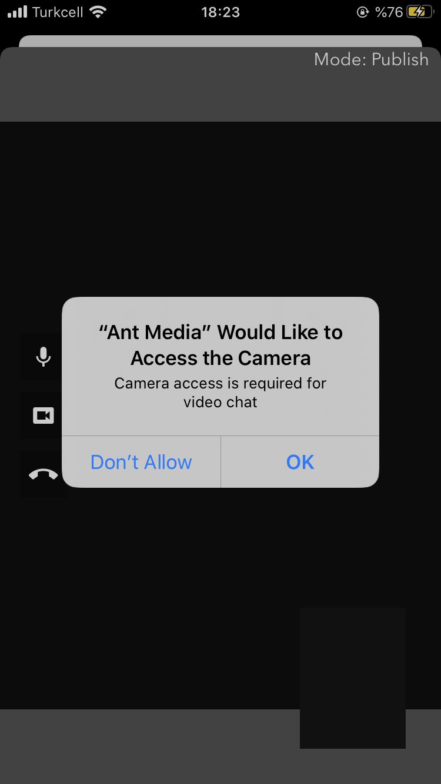
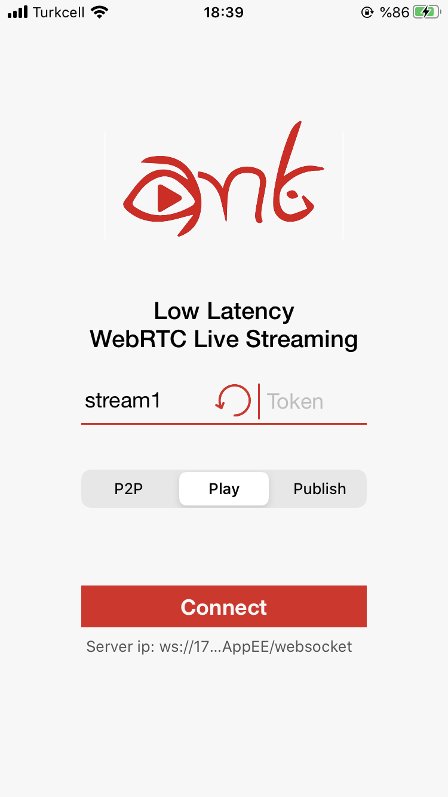
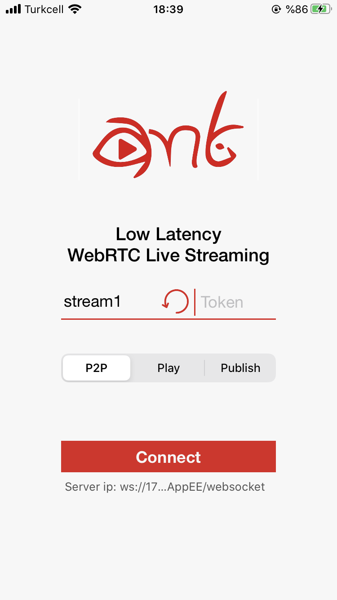

Ant Media's WebRTC iOS SDK lets you build your own iOS application that can publish and play WebRTC broadcasts with just a few lines of code.   
In this doc, we're going to cover the following topics. 
* How to Run the Sample WebRTC iOS app
  * Publish Stream from your iPhone
  * Play Stream on your iPhone
  * P2P Communication with your iPhone
* How to develop a WebRTC iOS app
  * Implement Publishing
  * Implement Playing
  * Implement Data Channel Communication
* FAQ 

## How to Run the Sample WebRTC iOS app

* ### Download the WebRTC iOS SDK
  WebRTC iOS and Android SDK's are free to download. You can access them through [this link on antmedia.io](https://antmedia.io/free-webrtc-android-ios-sdk/). If you're an enterprise user, it will be also available for you to download in your subscription page. Anyway, after you download the SDK, you can just unzip the file and open the project with Xcode. 

* ### Install Dependency

  Open your terminal and go to the directory where the reference project resides and run `pod install` . If you are not familiar with pods, visit [cocoapods.org](https://cocoapods.org/) for documentation and installation. 

  ```
  cd /go/to/the/directory/where/you/unzip/the/SDK
  pod install
  ```
  This install the Starscream packet for WebSocket connections. 

* ### Open and Run the Project in Xcode

  Open the Xcode in your MacOS and Click the Open Another Project if you don't see the Sample Project in your list.

  

  Go to the directory where you download and unzip the iOS SDK. Open the `AntMediaReferenceApplication.xcworkspace` file

  

  After project opens, connect your iPhone to your Mac and choose your iPhone in Xcode as shown below. 

  

* ### Publish Stream from your iPhone 

  Click `Run` button on the top left of the Xcode. Then project is going to be built and deployed to your iPhone. 

  

  Tap `Publish` button and then Tap `Set Server IP` under the connect button in your iPhone. 

  


  Write Your Ant Media Server's full WebSocket URL and tap `Save` button. Its format is like this `ws://192.168.7.25:5080/WebRTCAppEE/websocket`. If you install SSL to Ant Media Server, you can also use `wss://your_domain_address:5443/WebRTCAppEE/websocket`.

  


  Set the stream id to anything else then 'stream1' and Tap 'Connect' button on the main screen. Then it will ask you to access the Camera and Mic. After you allow the Camera and Mic access, stream will be published on Ant Media Server. 
 
  

  Then it will start Publishing to your Ant Media Server. You can go to the web panel of Ant Media Server(http://server_ip:5080) and watch the stream there.You can also quickly play the stream via https://your_domain:5443/WebRTCAppEE/player.html

* ### Play Stream on your iPhone
  Playing stream on your iPhone is almost the same as Publishing. Before playing, make sure that there is a stream is already publishing to the server with same stream id in your textbox (You can quickly publish to the Ant Media Server via https://your_domain:5443/WebRTCAppEE). For our sample, stream id is still "stream1" in the image below. Then you just need to tap 'Play' button and tap 'Connect' button.  
  

  After tapping 'Connect' button, stream will start playing. 

* ### P2P Communication with your iPhone
  WebRTC iOS SDK also supports P2P communication. As you guess, just tap 'P2P' and then 'Connect' button. 
  

  When there is another peer is connected to the same stream id via Android, iOS or Web, then P2P communication will be established and you can talk each other. You can quick connect to the same stream id via https://your_domain:5443/WebRTCAppEE/peer.html


* ## How to develop a WebRTC iOS app

 


  


