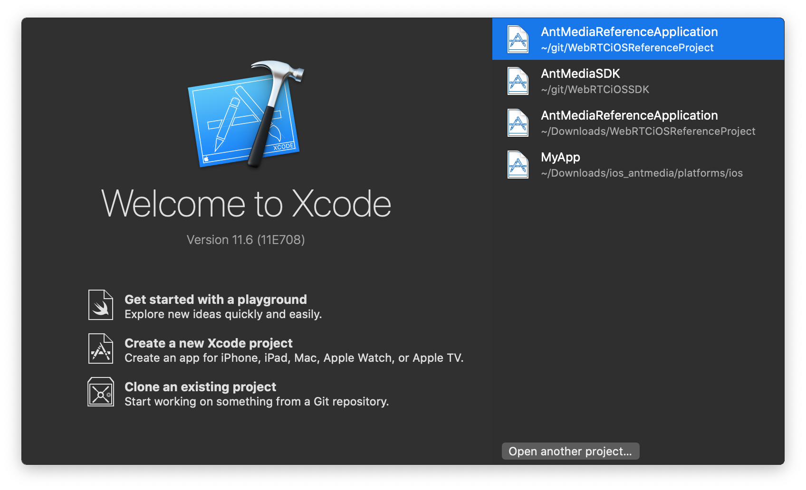
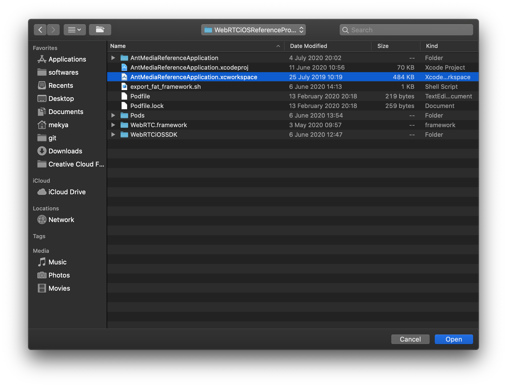
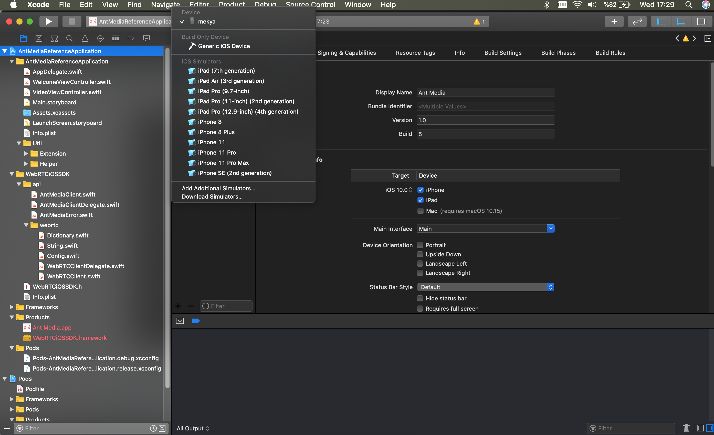
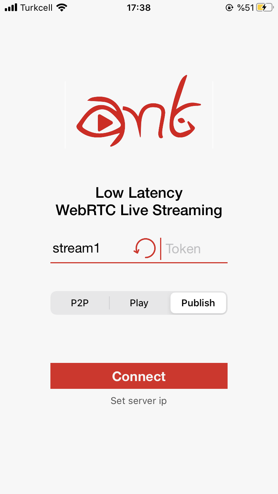

Ant Media's WebRTC iOS SDK lets you build your own iOS application that can publish and play WebRTC broadcasts with just a few lines of code.   
In this doc, we're going to cover the following topics. 
* How to run the sample WebRTC iOS app
* How to create a WebRTC iOS app
* FAQ 

## How to Run the Sample WebRTC iOS app

### Download the WebRTC iOS SDK
WebRTC iOS and Android SDK's are free to download. You can access them through [this link on antmedia.io](https://antmedia.io/free-webrtc-android-ios-sdk/). If you're an enterprise user, it will be also available for you to download in your subscription page. Anyway, after you download the SDK, you can just unzip the file and open the project with Xcode. 

* Open the Xcode in your MacOS and Click the Open Another Project if you don't see the Sample Project in your list.

* Go to the directory where you download and unzip the iOS SDK. Open the `AntMediaReferenceApplication.xcworkspace` file

* After project opens, connect your iPhone to your Mac and choose your iPhone in Xcode as shown below. 

* Click `Run` button on the top left of the Xcode. Then project is going to be built and deployed to your iPhone. 

* Tap `Publish` button and then Tap `Set Server IP` under the connect button in your iPhone. 

